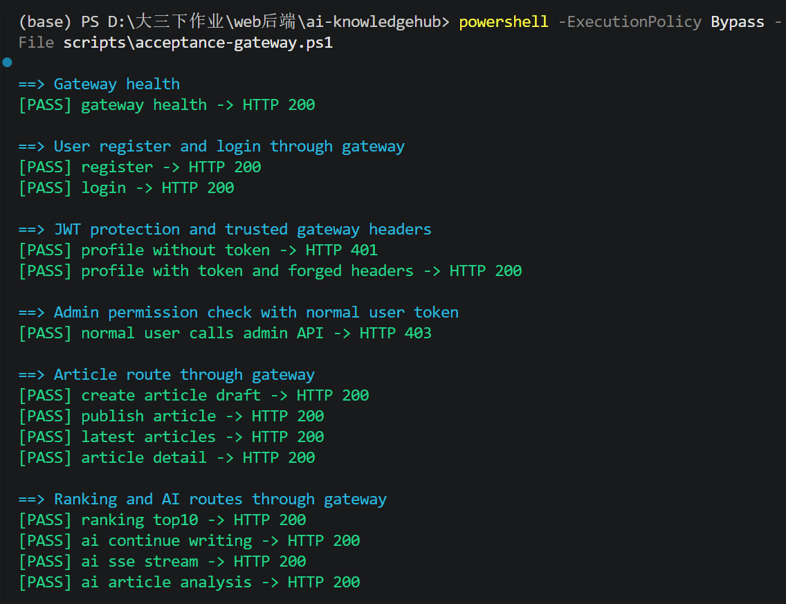
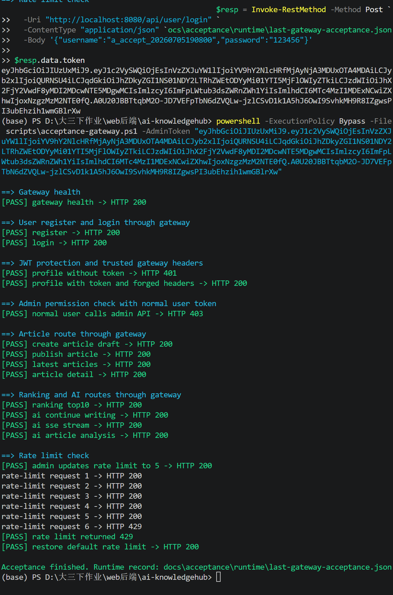
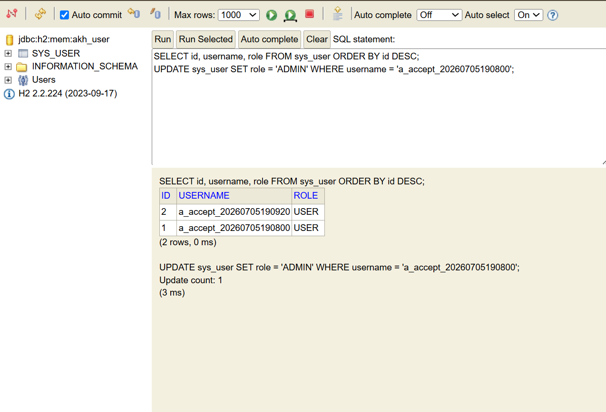
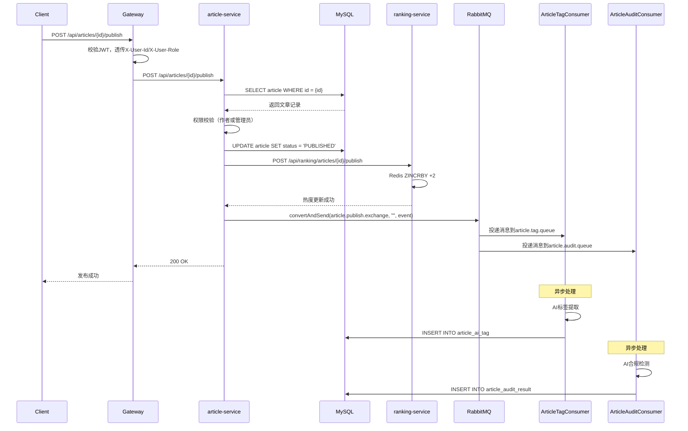

# Web后端\-AI\-KnowledgeHub\-课程设计报告

## **摘要**

本项目设计并实现了一个基于 AI 的智能知识库与内容发布平台，定位为“具备 AI 能力的知乎后台系统”原型。系统采用 Spring Boot \+ Spring Cloud Gateway 微服务架构，拆分为用户服务、文章服务、热榜服务、AI 服务和网关服务。平台支持用户注册登录、JWT 鉴权、文章草稿与发布、评论点赞、Redis ZSET 热榜、RabbitMQ 异步广播、AI 标签提取、AI 合规检测、AI SSE 流式续写等功能。

本项目重点不是堆叠普通 CRUD，而是围绕 Web 后端课程中的核心能力展开，包括统一网关入口、Redis 热点数据处理、消息队列异步解耦、AI 服务集成、SSE 流式响应以及生产环境高可用设计。开发过程中，团队使用 AI Coding 工具辅助需求拆解、代码生成、问题定位、测试设计和报告撰写，并沉淀了一套“人主导、AI 辅助、工程验证兜底”的开发方法。

**关键词**：微服务；Spring Cloud Gateway；JWT；Redis ZSET；RabbitMQ；SSE；AI Coding；后端架构

# **1\. 产品需求文档**


## **1\.1 项目背景**


随着内容社区和知识管理平台的发展，用户不仅希望能够发布、检索和互动内容，也希望系统能够提供智能化辅助能力，例如自动生成标签、内容合规检测、AI 写作续写等。本项目围绕“智能知识库与内容发布”场景，设计一个兼具传统内容平台能力和 AI 能力的后端系统。

与普通文章管理系统不同，本项目重点关注后端架构能力：当文章发布、阅读、点赞、评论、AI 分析等业务发生时，系统需要通过 Redis、RabbitMQ、Gateway、SSE 等技术实现更高效、更解耦、更具扩展性的处理链路。

## **1\.2 用户角色**

|角色|权限说明|
|---|---|
|游客|可查看已发布文章列表、文章详情、热榜、部分公开接口|
|普通用户|可注册、登录、注销、查看个人信息、创建草稿、发布文章、评论、点赞、调用 AI 续写|
|管理员|拥有普通用户能力，并可管理限流配置、审核或管理内容，具备更高权限|
|系统服务|包括 AI 消费者、热榜服务、MQ 消费者等内部服务角色，用于异步处理业务事件|


## **1\.3 功能需求**

### **1\.3\.1 用户认证功能**


|编号|功能|说明|
|---|---|---|
|FR\-U\-01|用户注册|用户输入用户名和密码完成注册|
|FR\-U\-02|用户登录|登录成功后返回 JWT Token|
|FR\-U\-03|用户注销|注销后 Token 可进入 Redis 黑名单|
|FR\-U\-04|查询个人信息|根据网关透传的用户 ID 查询当前用户|
|FR\-U\-05|角色识别|支持普通用户和管理员角色|

### **1\.3\.2 文章管理功能**

|编号|功能|说明|
|---|---|---|
|FR\-A\-01|创建文章草稿|登录用户可创建草稿|
|FR\-A\-02|修改文章|作者本人或管理员可修改文章|
|FR\-A\-03|发布文章|草稿状态改为已发布，并发送 MQ 事件|
|FR\-A\-04|逻辑删除文章|删除文章时不物理删除数据库记录|
|FR\-A\-05|分页查询最新文章|按发布时间倒序查询|
|FR\-A\-06|查询文章详情|查询详情时阅读量增加，热度更新|


### **1\.3\.3 评论与点赞功能**


|编号|功能|说明|
|---|---|---|
|FR\-I\-01|评论文章|用户可对文章发表评论|
|FR\-I\-02|查询评论列表|支持分页查询文章评论|
|FR\-I\-03|点赞文章|用户可点赞文章|
|FR\-I\-04|防重复点赞|同一用户对同一文章只能点赞一次|


### **1\.3\.4 热榜功能**


|编号|功能|说明|
|---|---|---|
|FR\-R\-01|阅读热度增加|阅读文章热度 \+1|
|FR\-R\-02|发布热度增加|发布文章热度 \+2|
|FR\-R\-03|评论热度增加|评论文章热度 \+3|
|FR\-R\-04|点赞热度增加|点赞文章热度 \+5|
|FR\-R\-05|查询 Top10 热榜|使用 Redis ZSET 查询全站热榜|


### **1\.3\.5 AI 功能**


|编号|功能|说明|
|---|---|---|
|FR\-AI\-01|AI 同步续写|根据用户输入 prompt 返回续写内容|
|FR\-AI\-02|AI SSE 流式续写|使用 SSE 逐字或逐句返回生成内容|
|FR\-AI\-03|AI 标签提取|文章发布后异步提取标签|
|FR\-AI\-04|AI 合规检测|文章发布后异步进行合规检测|
|FR\-AI\-05|查询 AI 分析结果|查询文章标签和合规检测结果|


### **1\.3\.6 网关与限流功能**


|编号|功能|说明|
|---|---|---|
|FR\-G\-01|统一入口|所有外部请求通过 `gateway-service`|
|FR\-G\-02|JWT 鉴权|网关统一校验 Token|
|FR\-G\-03|用户信息透传|网关向下游服务透传 `X-User-Id`、`X-User-Role`|
|FR\-G\-04|管理员权限判断|管理员接口需要 `ADMIN` 角色|
|FR\-G\-05|动态限流|对文章详情接口做 IP 限流|
|FR\-G\-06|限流配置动态修改|管理员可调整限流窗口和阈值|


## **1\.4 非功能需求**


|类型|需求说明|
|---|---|
|可扩展性|系统拆分为多个微服务，后续可独立扩容|
|可维护性|使用 `common` 模块统一返回、异常、JWT、分页等能力|
|安全性|使用 BCrypt 存储密码，使用 JWT 进行鉴权|
|高性能|热榜使用 Redis ZSET，避免频繁查库排序|
|解耦性|文章发布后通过 RabbitMQ 异步广播处理 AI 任务|
|可观测性|通过日志记录关键业务链路和 MQ 消费过程|
|可测试性|提供 Postman Collection 支持接口验证|
|可部署性|使用 Docker Compose 启动 MySQL、Redis、RabbitMQ|
|兼容性|本地原型使用 H2 / Mock LLM，生产环境可切换 MySQL / 真实 LLM|


## **1\.5 核心业务逻辑**


### **1\.5\.1 登录与鉴权链路**


```Plain Text
用户登录
-> user-service 校验用户名密码
-> 生成 JWT Token
-> 客户端后续请求携带 Authorization Header
-> gateway-service 校验 Token
-> 网关透传 X-User-Id / X-User-Role
-> 下游服务根据用户上下文执行业务
```


### **1\.5\.2 文章发布链路**


```Plain Text
用户创建草稿
-> 修改文章内容
-> 发布文章
-> article-service 修改文章状态为 PUBLISHED
-> article-service 发送 ArticlePublishedEvent 到 RabbitMQ
-> ranking-service 增加发布热度
-> ai-service 两个消费者异步处理标签和合规检测
```


### **1\.5\.3 热榜更新链路**


```Plain Text
用户阅读 / 点赞 / 评论 / 发布文章
-> article-service 调用 ranking-service
-> ranking-service 使用 Redis ZSET 增加文章热度
-> 客户端查询 Top10 热榜
```


### **1\.5\.4 AI 异步处理链路**


```Plain Text
文章发布成功
-> RabbitMQ Fanout Exchange 广播事件
-> article.tag.queue 收到消息
-> AI 标签消费者提取标签并入库
-> article.audit.queue 收到消息
-> AI 合规消费者检测内容并入库
```


### **1\.5\.5 AI SSE 流式续写链路**


```Plain Text
用户输入 prompt
-> gateway-service 转发到 ai-service
-> ai-service 生成内容片段
-> SseEmitter 逐段推送
-> 客户端实时接收生成内容
```


## **1\.6 范围界定**


### **1\.6\.1 本项目实现范围**


- 用户注册、登录、注销、个人信息查询。

- JWT 鉴权与角色识别。

- 文章草稿、修改、发布、删除、列表、详情。

- 评论与点赞。

- Redis 热榜 Top10。

- RabbitMQ 文章发布事件广播。

- AI 标签提取、AI 合规检测、AI 续写。

- SSE 流式响应。

- Docker Compose 启动中间件。

- Swagger / OpenAPI 文档。

- Postman 接口测试集。

### **1\.6\.2 本项目暂不实现范围**


|不实现内容|原因|
|---|---|
|完整前端页面|本课程重点考察 Web 后端架构，接口可通过 Postman 验证|
|真实线上部署|受限于课程作业环境，本项目以本地原型为主|
|真实 LLM API 强依赖|为保证演示稳定，本地使用 Mock LLM|
|完整管理员后台|仅保留管理员角色和关键管理接口|
|复杂推荐算法|热榜使用 Redis ZSET 热度分值，不做个性化推荐|
|分布式事务|当前原型采用最终一致性思路，生产环境再引入可靠消息方案|
|完整监控告警系统|报告中给出生产环境演进方案，本地不完整搭建|


**\-\-\-**


# **2\. 系统总体设计**


## **2\.1 系统架构概览**


|服务|端口|职责|
|---|---|---|
|`gateway-service`|8080|统一入口、路由、JWT 鉴权、限流|
|`user-service`|8081|用户注册、登录、注销、个人信息|
|`article-service`|8082|文章、评论、点赞、MQ 发布|
|`ranking-service`|8083|Redis ZSET 热榜|
|`ai-service`|8084|AI 续写、SSE、标签提取、合规检测|
|`common`|\-|公共返回、异常、JWT、Swagger、分页工具|


## **2\.2 系统架构图**


```Plain Text
flowchart TB
    Client["Postman / Apifox / Client"] --> Gateway["gateway-service<br/>统一入口 / JWT / 限流"]

    Gateway --> User["user-service<br/>用户认证"]
    Gateway --> Article["article-service<br/>文章 / 评论 / 点赞"]
    Gateway --> Ranking["ranking-service<br/>热榜"]
    Gateway --> AI["ai-service<br/>AI / SSE / MQ 消费"]

    User --> MySQL[("MySQL")]
    Article --> MySQL
    AI --> MySQL

    Article --> Redis[("Redis")]
    Ranking --> Redis
    Gateway --> Redis

    Article --> MQ["RabbitMQ Fanout Exchange"]
    MQ --> TagQueue["article.tag.queue"]
    MQ --> AuditQueue["article.audit.queue"]
    TagQueue --> AI
    AuditQueue --> AI

    AI --> MockLLM["Mock LLM / Real LLM API"]
```


## **2\.3 模块划分**


### **2\.3\.1 \`common\`**


- `ApiResponse`：统一返回结构。

- `ResultCode`：统一错误码。

- `BusinessException`：业务异常。

- `AuthException`：鉴权异常。

- `GlobalExceptionHandler`：全局异常处理。

- `JwtUtil`：JWT 生成和解析。

- `SecurityUtils`：获取当前用户上下文。

- `PageRequest` / `PageResult`：统一分页对象。

- `SwaggerConfig`：接口文档配置。

- `MybatisPlusConfig`：MyBatis\-Plus 基础配置。

### **2\.3\.2 \`gateway\-service\`**


- 路由转发。

- JWT 校验。

- 白名单放行。

- 用户 ID 和角色透传。

- 管理员接口权限判断。

- 动态限流。

- 统一 401 / 403 / 429 响应。

### **2\.3\.3 \`user\-service\`**


- 用户注册。

- 密码 BCrypt 加密。

- 用户登录。

- JWT 签发。

- Token 黑名单。

- 当前用户信息查询。

### **2\.3\.4 \`article\-service\`**


- 创建草稿。

- 修改文章。

- 发布文章。

- 逻辑删除。

- 查询列表和详情。

- 评论。

- 点赞。

- 发布文章后发送 MQ 消息。

- 调用 `ranking-service` 更新热度。

### **2\.3\.5 \`ranking\-service\`**


- 支持使用 Redis ZSET 维护热度分值，同时保留内存 Map 模式用于本地开发和演示兜底。

- 支持阅读、发布、评论、点赞不同分值更新。

- 查询 Top10 热榜。

- 可扩展热度衰减、文章信息补全等能力。

### **2\.3\.6 \`ai\-service\`**


- 同步续写。

- SSE 流式续写。

- 监听文章发布事件。

- 标签提取。

- 合规检测。

- 查询文章 AI 分析结果。

## **2\.4 针对非功能需求的架构设计**


### **2\.4\.1 可扩展性设计**


系统按业务边界拆分为多个服务，不同服务可以独立部署和扩容。例如：


- 热榜访问频繁时，可单独扩容 `ranking-service`。

- AI 调用耗时较长时，可单独扩容 `ai-service`。

- 网关流量较高时，可部署多个 `gateway-service` 实例。

### **2\.4\.2 高性能设计**


- 热榜使用 Redis ZSET，避免每次从 MySQL 聚合排序。

- 点赞、评论、阅读只更新热度分数，Top10 查询复杂度低。

- 文章发布后的 AI 处理通过 MQ 异步执行，不阻塞发布接口。

### **2\.4\.3 高可用设计**


本地原型中以单实例为主，生产环境可演进为：


- Gateway 多实例部署。

- 各业务服务多副本部署。

- MySQL 主从复制。

- Redis Sentinel 或 Redis Cluster。

- RabbitMQ 集群。

- AI 调用失败降级到 Mock 或缓存结果。

- 限流、熔断、降级保护下游服务。

### **2\.4\.4 安全性设计**


- 密码使用 BCrypt 加密，不存储明文密码。

- JWT Token 用于无状态认证。

- 网关统一鉴权，减少下游服务重复鉴权逻辑。

- 注销后 Token 可写入 Redis 黑名单。

- 管理员接口校验角色。

- 统一异常返回，避免泄露堆栈信息。

### **2\.4\.5 解耦设计**


- 文章发布与 AI 处理解耦。

- `article-service` 不直接等待 AI 结果。

- RabbitMQ Fanout Exchange 将同一事件广播给多个消费者。

- 标签提取与合规检测互不影响。

## **2\.5 技术栈**


|分类|技术|用途|
|---|---|---|
|后端框架|Spring Boot 3\.2\.5|构建业务服务|
|微服务网关|Spring Cloud Gateway|统一入口、路由、鉴权|
|ORM|MyBatis\-Plus|数据访问|
|数据库|MySQL / H2|生产数据 / 本地开发|
|缓存与热榜|Redis|ZSET 热榜、限流、Token 黑名单|
|消息队列|RabbitMQ|文章发布事件广播|
|API 文档|Knife4j / Swagger / OpenAPI|接口文档|
|鉴权|JWT / JJWT|Token 生成和校验|
|实时响应|SSE / SseEmitter|AI 流式续写|
|部署|Docker Compose|本地中间件环境|
|测试|Postman / JUnit|接口测试与单元测试|
|AI 辅助|Codex / Qoder / Claude 等|代码生成、调试、报告辅助|


**\-\-\-**


# **3\. 产品原型设计**


## **3\.1 原型说明**


由于本项目为 Web 后端课程设计，课程重点不要求完整前端界面，因此本项目主要通过 API 文档、Postman Collection、接口返回数据和关键运行截图展示产品原型。


产品原型主要体现以下用户操作流程：


1. 用户注册。

2. 用户登录并获取 Token。

3. 创建文章草稿。

4. 发布文章。

5. 查询文章详情。

6. 点赞与评论。

7. 查看热榜。

8. 查询 AI 分析结果。

9. 调用 AI SSE 流式续写。

10. 测试网关限流效果。

## **3\.2 用户登录原型**


### **3\.2\.1 功能说明**


用户输入用户名和密码，登录成功后系统返回 JWT Token。后续请求通过 `Authorization: Bearer <token>` 携带登录状态。


### **3\.2\.2 关键截图**

最终验收时统一通过 `http://localhost:8080` 网关访问用户接口。登录、Token 返回、无 Token 返回 401、携带 Token 查询个人信息等结果已通过验收脚本验证。

```Markdown

```


## **3\.3 文章发布原型**


### **3\.3\.1 功能说明**


用户创建草稿后，可以将文章发布。发布成功后系统会发送 MQ 消息，并触发 AI 标签提取和合规检测。


### **3\.3\.2 关键截图**

验收脚本会自动创建文章草稿并发布文章，随后通过网关查询最新文章列表和文章详情，用于证明文章服务路由、JWT 用户信息透传和文章发布链路正常。

```Markdown

```


## **3\.4 热榜展示原型**


### **3\.4\.1 功能说明**


用户阅读、点赞、评论文章后，`ranking-service` 更新文章热度分数。当前实现支持 Redis ZSET 模式和本地内存 Map 模式两种数据源（`RankingService` 中通过 `ranking.use-redis` 切换）。

本次最终验收采用 **Redis ZSET 模式**（`ranking.use-redis: true`）作为默认展示口径，热榜分数真实写入 Redis 的 `article:hot:ranking` 键。Redis 实例的部署位置视运行环境而定：若 `docker compose up -d` 已启动 `akh-redis`，通过 `docker exec akh-redis redis-cli ZREVRANGE article:hot:ranking 0 9 WITHSCORES` 即可读取；若本机另有原生 redis-server 进程监听 `localhost:6379`，同样通过 `redis-cli -h localhost` 即可拉取，二者返回完全一致，因为数据落到同一个 Redis ZSET 上。本地内存 Map 模式保留在源码与配置中，作为开发期回退（演示当天若 Redis 异常，可临时改回 `false` 兜底）。


### **3\.4\.2 关键截图**

验收脚本通过 `GET /api/ranking/top10` 验证热榜服务可经由网关访问，并能返回文章热度数据。HTTP 层响应结构已统一为 `ApiResponse`（`code/message/data/timestamp`），与 user-service / article-service / ai-service 保持一致。

```Markdown

```

Redis 层验证通过 `redis-cli` 直接拉取 ZSET（推荐 `redis-cli -h localhost`，若 `docker compose up -d akh-redis` 已启动亦可使用 `docker exec akh-redis redis-cli`），证明数据真实写入 Redis 而非停留在内存 Map：

```Markdown

```

> 说明：本轮最终验收采用 **运行时文本证据** 替代 GUI 截图，证据文件位于
>
> ```
> docs/acceptance/ranking/b-redis-zset-evidence.txt
> ```
>
> 其中 [4] 节用 `Http data.total == Redis ZCARD` 的方式做出 ZSET 与 HTTP 接口的交叉校验，证明 ZSET 是热榜数据的真实数据源。`b-ranking-http-top10.png` / `b-ranking-redis-zset.png` 为占位文件名，验收当天若老师需要 GUI 截图，由 B 通过 PowerShell 的 `红框 / Win+Shift+S` 对上述文本证据对应的 redis-cli 终端输出截屏后覆盖提交。


## **3\.5 AI 流式续写原型**


### **3\.5\.1 功能说明**


用户输入 prompt 后，`ai-service` 通过 SSE 持续返回生成内容，模拟真实 AI 模型的流式输出效果。

AI 流式续写用于模拟真实大模型逐段生成内容的交互效果。用户输入 prompt 后，请求会通过 `gateway-service` 转发到 `ai-service`，由 AI 服务生成模拟续写内容，并通过 SSE 持续返回给客户端。相比普通 HTTP 一次性返回结果，SSE 可以让用户在生成过程中逐步看到内容，交互体验更接近真实 AI 产品。

本项目采用 Mock LLM 作为课程演示方案，不依赖真实外部大模型 API，避免 API Key、额度和网络环境影响演示稳定性。该设计保留了完整的接口结构，后续如需接入真实大模型，只需要替换 `AiService` 内部生成逻辑。


### **3\.5\.2 关键截图**

AI 同步续写、SSE 流式续写和文章 AI 分析结果查询均通过 `gateway-service` 访问。由于 `/api/ai/**` 属于登录用户能力，验收脚本会携带用户 Token 调用。

```Markdown

```


## **3\.6 RabbitMQ 消费原型**


### **3\.6\.1 功能说明**


文章发布事件进入 RabbitMQ 后，标签消费者和合规检测消费者分别处理同一篇文章，体现 Fanout 广播模式。

文章发布成功后，`article-service` 会向 RabbitMQ 发布文章发布事件。`ai-service` 作为消费者监听两个队列：`article.tag.queue` 用于 AI 标签提取，`article.audit.queue` 用于 AI 合规检测。两个消费者互相独立，分别处理标签生成和内容审核任务，处理完成后将结果写入 `article_ai_tag` 和 `article_audit_result` 表。

这种设计将文章发布主流程和 AI 分析任务解耦，避免 AI 分析耗时影响文章发布接口响应速度。


### **3\.6\.2 关键截图**

文章发布后，`ai-service` 消费 RabbitMQ 消息并写入标签和合规检测结果。验收脚本通过 `GET /api/ai/articles/{id}/analysis` 查询到 tag 与 audit 数据，间接证明 MQ 消费链路可用。

```Markdown

```


**\-\-\-**


# **4\. 数据库设计**


## **4\.1 数据库设计概览**


|表名|说明|
|---|---|
|`user`|用户表|
|`article`|文章表|
|`comment`|评论表|
|`article_like`|点赞记录表|
|`article_ai_tag`|AI 标签结果表|
|`article_audit_result`|AI 合规检测结果表|
|`tag`|标签表|
|`article_tag`|文章标签关联表|


## **4\.2 ER 图**


```Plain Text
erDiagram
    user ||--o{ article : writes
    user ||--o{ comment : creates
    user ||--o{ article_like : likes

    article ||--o{ comment : has
    article ||--o{ article_like : has
    article ||--o{ article_ai_tag : has
    article ||--o{ article_audit_result : has
    article ||--o{ article_tag : has

    tag ||--o{ article_tag : maps

    user {
        bigint id PK
        varchar username
        varchar password_hash
        varchar role
        varchar status
        datetime create_time
        datetime update_time
        tinyint deleted
    }

    article {
        bigint id PK
        bigint author_id FK
        varchar title
        text content
        varchar summary
        varchar status
        bigint view_count
        bigint like_count
        bigint comment_count
        datetime published_at
        tinyint deleted
    }

    comment {
        bigint id PK
        bigint article_id FK
        bigint user_id FK
        text content
        datetime created_at
    }

    article_like {
        bigint id PK
        bigint article_id FK
        bigint user_id FK
        datetime created_at
    }

    article_ai_tag {
        bigint id PK
        bigint article_id FK
        text tags
        varchar model_name
        datetime created_at
    }

    article_audit_result {
        bigint id PK
        bigint article_id FK
        varchar result
        varchar reason
        varchar model_name
        datetime created_at
    }

    tag {
        bigint id PK
        varchar name
        datetime created_at
    }

    article_tag {
        bigint id PK
        bigint article_id FK
        bigint tag_id FK
    }
```


## **4\.3 主要表结构**


### **4\.3\.1 \`user\`**


|字段|类型|约束|说明|
|---|---|---|---|
|`id`|BIGINT|PK, AUTO\_INCREMENT|用户 ID|
|`username`|VARCHAR\(50\)|UNIQUE, NOT NULL|用户名|
|`password_hash`|VARCHAR\(255\)|NOT NULL|BCrypt 密码哈希|
|`role`|VARCHAR\(20\)|NOT NULL|USER / ADMIN|
|`status`|VARCHAR\(20\)|NOT NULL|ENABLED / DISABLED|
|`create_time`|DATETIME|\-|创建时间|
|`update_time`|DATETIME|\-|更新时间|
|`deleted`|TINYINT|DEFAULT 0|逻辑删除|


### **4\.3\.2 \`article\`**


|字段|类型|约束|说明|
|---|---|---|---|
|`id`|BIGINT|PK|文章 ID|
|`author_id`|BIGINT|FK|作者 ID|
|`title`|VARCHAR\(200\)|NOT NULL|标题|
|`content`|TEXT|NOT NULL|正文|
|`summary`|VARCHAR\(500\)|\-|摘要|
|`status`|VARCHAR\(20\)|\-|DRAFT / PUBLISHED|
|`view_count`|BIGINT|DEFAULT 0|阅读数|
|`like_count`|BIGINT|DEFAULT 0|点赞数|
|`comment_count`|BIGINT|DEFAULT 0|评论数|
|`published_at`|DATETIME|\-|发布时间|
|`deleted`|TINYINT|DEFAULT 0|逻辑删除|

**索引设计：**

- idx\_author\_id：按作者ID查询文章列表

- idx\_status：按状态筛选已发布/草稿文章

- idx\_deleted：逻辑删除过滤

- idx\_created\_at：按创建时间排序

- idx\_published\_at：按发布时间排序

- idx\_view\_count：按阅读数排序

- idx\_like\_count：按点赞数排序

### **4\.3\.3 \`comment\`**


|字段|类型|约束|说明|
|---|---|---|---|
|`id`|BIGINT|PK|评论 ID|
|`article_id`|BIGINT|FK|文章 ID|
|`user_id`|BIGINT|FK|用户 ID|
|`content`|TEXT|NOT NULL|评论内容|
|`created_at`|DATETIME|\-|创建时间|

**索引设计：**

- idx\_article\_id：按文章ID查询评论列表

- idx\_user\_id：按用户ID查询评论记录

- idx\_deleted：逻辑删除过滤

- idx\_created\_at：按时间倒序排列评论

### **4\.3\.4 \`article\_like\`**


|字段|类型|约束|说明|
|---|---|---|---|
|`id`|BIGINT|PK|点赞 ID|
|`article_id`|BIGINT|FK|文章 ID|
|`user_id`|BIGINT|FK|用户 ID|
|`created_at`|DATETIME|\-|点赞时间|

**唯一索引：**

- uk\_article\_user \(article\_id, user\_id\)：防止同一用户对同一文章重复点赞

**索引设计：**

- idx\_user\_id：按用户ID查询点赞记录

- idx\_created\_at：按点赞时间排序

### **4\.3\.5 \`article\_ai\_tag\`**


|字段|类型|约束|说明|
|---|---|---|---|
|`id`|BIGINT|PK|主键|
|`article_id`|BIGINT|FK|文章 ID|
|`tags`|TEXT|\-|标签 JSON|
|`model_name`|VARCHAR\(100\)|\-|AI 模型名称|
|`created_at`|DATETIME|\-|创建时间|


### **4\.3\.6 \`article\_audit\_result\`**


|字段|类型|约束|说明|
|---|---|---|---|
|`id`|BIGINT|PK|主键|
|`article_id`|BIGINT|FK|文章 ID|
|`result`|VARCHAR\(20\)|\-|PASS / REVIEW / REJECT|
|`reason`|VARCHAR\(500\)|\-|检测原因|
|`model_name`|VARCHAR\(100\)|\-|AI 模型名称|
|`created_at`|DATETIME|\-|创建时间|


## **4\.4 Redis Key 设计**


|Key|类型|说明|
|---|---|---|
|`article:hot:ranking`|ZSET|文章热榜|
|`rate_limit:{ip}:{path}`|String|网关限流计数|
|`rate_limit_config:article_detail`|Hash|文章详情限流配置|
|`token:blacklist:{jti}`|String|Token 黑名单|

**热榜ZSET详细设计：**

```Plain Text
Key: article:hot:ranking
Type: ZSET
Member: articleId（字符串格式）
Score: hotScore（双精度浮点数）
```


**热度计算规则：**

|行为|分值增量|
|---|---|
|阅读文章|\+1\.0|
|发布文章|\+2\.0|
|评论文章|\+3\.0|
|点赞文章|\+5\.0|

## **4\.5 RabbitMQ 设计**


|组件|名称|说明|
|---|---|---|
|Exchange|`article.publish.exchange`|文章发布 Fanout 交换机|
|Queue|`article.tag.queue`|AI 标签提取队列|
|Queue|`article.audit.queue`|AI 合规检测队列|

**消息格式：**

```JSON
{
  "articleId": 1001,
  "title": "文章标题",
  "content": "文章内容...",
  "authorId": 1,
  "publishedAt": "2026-07-05T10:30:00"
}
```


**绑定关系：**

```Plain Text
flowchart LR
    A[article.publish.exchange] --> B[article.tag.queue]
    A --> C[article.audit.queue]
```

# **5\. API 接口设计**


## **5\.1 统一接口规范**


### **5\.1\.1 统一返回结构**


```JSON
{
  "code": 200,
  "message": "操作成功",
  "data": {}
}
```


### **5\.1\.2 统一错误码**


|code|含义|
|---|---|
|200|成功|
|400|请求参数错误|
|401|未登录或 Token 无效|
|403|无权限|
|404|资源不存在|
|409|数据冲突|
|422|参数校验失败|
|429|请求过于频繁|
|500|服务内部错误|


### **5\.1\.3 JWT Header**


```HTTP
Authorization: Bearer <token>
```


网关透传：


```HTTP
X-User-Id: 12
X-User-Role: USER
X-User-Name: alice
```


## **5\.2 用户接口**


|方法|路径|说明|是否登录|
|---|---|---|---|
|POST|`/api/user/register`|用户注册|否|
|POST|`/api/user/login`|用户登录|否|
|POST|`/api/user/logout`|用户注销|是|
|GET|`/api/user/profile`|当前用户信息|是|


### **5\.2\.1 注册接口**


请求：


```JSON
{
  "username": "alice",
  "password": "123456"
}
```


响应：


```JSON
{
  "code": 200,
  "message": "操作成功",
  "data": {
    "userId": 1
  }
}
```


### **5\.2\.2 登录接口**


请求：


```JSON
{
  "username": "alice",
  "password": "123456"
}
```


响应：


```JSON
{
  "code": 200,
  "message": "登录成功",
  "data": {
    "token": "jwt-token",
    "user": {
      "id": 1,
      "username": "alice",
      "role": "USER"
    }
  }
}
```


## **5\.3 文章接口**


|方法|路径|说明|是否登录|
|---|---|---|---|
|POST|`/api/articles/draft`|创建草稿|是|
|PUT|`/api/articles/{id}`|修改文章|是|
|POST|`/api/articles/{id}/publish`|发布文章|是|
|DELETE|`/api/articles/{id}`|逻辑删除|是|
|GET|`/api/articles/latest`|最新文章|否|
|GET|`/api/articles/{id}`|文章详情|否|
|GET|`/api/articles/hot`|热门文章|否|

#### **5\.3\.1 创建文章草稿**


**路径：** \`POST /api/articles/draft\`

**请求Header：**

|Header|必填|说明|
|---|---|---|
|X\-User\-Id|是|当前用户ID（网关透传）|

**请求体：**

```JSON
{
  "title": "文章标题",
  "content": "文章正文内容",
  "summary": "文章摘要"
}
```

|字段|类型|必填|说明|
|---|---|---|---|
|title|String|是|文章标题，最大200字符|
|content|String|是|文章正文内容|
|summary|String|否|文章摘要，最大500字符|

**成功响应：**

```JSON
{
  "code": 200,
  "message": "success",
  "data": {
    "articleId": 1001
  }
}
```

#### **5\.3\.2 修改文章**

**路径：** \`PUT /api/articles/\{id\}\`

**请求Header：**

|Header|必填|说明|
|---|---|---|
|X\-User\-Id|是|当前用户ID（网关透传）|
|X\-User\-Role|是|当前用户角色（网关透传）|

**请求体：**

```JSON
{
  "title": "修改后的文章标题",
  "content": "修改后的文章正文内容",
  "summary": "修改后的文章摘要"
}
```

**成功响应：**

```JSON
{
  "code": 200,
  "message": "success",
  "data": null
}
```

#### **5\.3\.3 发布文章**

**路径：** \`POST /api/articles/\{id\}/publish\`

**请求Header：**

|Header|必填|说明|
|---|---|---|
|X\-User\-Id|是|当前用户ID（网关透传）|
|X\-User\-Role|是|当前用户角色（网关透传）|

**成功响应：**

```JSON
{
  "code": 200,
  "message": "success",
  "data": null
}
```

#### **5\.3\.4 删除文章**

**路径：** \`DELETE /api/articles/\{id\}\`

**请求Header：**

|Header|必填|说明|
|---|---|---|
|X\-User\-Id|是|当前用户ID（网关透传）|
|X\-User\-Role|是|当前用户角色（网关透传）|

**成功响应：**

```JSON
{
  "code": 200,
  "message": "success",
  "data": null
}
```

#### **5\.3\.5 获取最新文章列表**

**路径：** \`GET /api/articles/latest\`

**请求参数：**

|参数|类型|必填|默认值|说明|
|---|---|---|---|---|
|page|Integer|否|1|页码|
|size|Integer|否|10|每页数量|

**成功响应：**

```JSON
{
  "code": 200,
  "message": "success",
  "data": {
    "list": [
      {
        "id": 1001,
        "authorId": 1,
        "title": "文章标题",
        "summary": "文章摘要",
        "status": "PUBLISHED",
        "viewCount": 100,
        "likeCount": 20,
        "commentCount": 5,
        "createdAt": "2026-07-05T10:00:00",
        "updatedAt": "2026-07-05T10:30:00",
        "publishedAt": "2026-07-05T10:30:00"
      }
    ],
    "total": 100,
    "page": 1,
    "size": 10
  }
}
```

#### **5\.3\.6 获取文章详情**

**路径：** \`GET /api/articles/\{id\}\`

**成功响应：**

```JSON
{
  "code": 200,
  "message": "success",
  "data": {
    "id": 1001,
    "authorId": 1,
    "title": "文章标题",
    "content": "文章正文内容",
    "summary": "文章摘要",
    "status": "PUBLISHED",
    "viewCount": 101,
    "likeCount": 20,
    "commentCount": 5,
    "createdAt": "2026-07-05T10:00:00",
    "updatedAt": "2026-07-05T10:30:00",
    "publishedAt": "2026-07-05T10:30:00"
  }
}
```

#### **5\.3\.7 获取热门文章列表**

**路径：** \`GET /api/articles/hot\`

**成功响应：**

```JSON
{
  "code": 200,
  "message": "success",
  "data": [
    {
      "id": 1001,
      "authorId": 1,
      "title": "热门文章标题",
      "summary": "文章摘要",
      "status": "PUBLISHED",
      "viewCount": 1000,
      "likeCount": 200,
      "commentCount": 50,
      "createdAt": "2026-07-05T10:00:00",
      "updatedAt": "2026-07-05T10:30:00",
      "publishedAt": "2026-07-05T10:30:00"
    }
  ]
}
```

## **5\.4 评论与点赞接口**

|方法|路径|说明|是否登录|
|---|---|---|---|
|POST|`/api/articles/{id}/comments`|发表评论|是|
|GET|`/api/articles/{id}/comments`|评论列表|否|
|POST|`/api/articles/{id}/like`|点赞文章|是|

#### **5\.4\.1 评论文章**

**路径：** \`POST /api/articles/\{id\}/comments\`

**请求Header：**

|Header|必填|说明|
|---|---|---|
|X\-User\-Id|是|当前用户ID（网关透传）|

**请求体：**

```JSON
{
  "content": "这是一条评论内容"
}
```

|字段|类型|必填|说明|
|---|---|---|---|
|content|String|是|评论内容，最大1000字符|

**成功响应：**

```JSON
{
  "code": 200,
  "message": "success",
  "data": {
    "commentId": 5001
  }
}
```

#### **5\.4\.2 获取文章评论列表**

**路径：** \`GET /api/articles/\{id\}/comments\`

**请求参数：**

|参数|类型|必填|默认值|说明|
|---|---|---|---|---|
|page|Integer|否|1|页码|
|size|Integer|否|10|每页数量|

**成功响应：**

```JSON
{
  "code": 200,
  "message": "success",
  "data": {
    "list": [
      {
        "id": 5001,
        "articleId": 1001,
        "userId": 1,
        "content": "评论内容",
        "createdAt": "2026-07-05T11:00:00"
      }
    ],
    "total": 10,
    "page": 1,
    "size": 10
  }
}
```

#### **5\.4\.3 点赞文章**

**路径：** \`POST /api/articles/\{id\}/like\`

**请求Header：**

|Header|必填|说明|
|---|---|---|
|X\-User\-Id|是|当前用户ID（网关透传）|

**成功响应：**

```JSON
{
  "code": 200,
  "message": "success",
  "data": null
}
```

## **5\.5 热榜接口**


|方法|路径|说明|
|---|---|---|
|POST|`/api/ranking/articles/{id}/view`|阅读热度 \+1|
|POST|`/api/ranking/articles/{id}/publish`|发布热度 \+2|
|POST|`/api/ranking/articles/{id}/comment`|评论热度 \+3|
|POST|`/api/ranking/articles/{id}/like`|点赞热度 \+5|
|GET|`/api/ranking/top10`|查询 Top10|

#### **5\.5\.1 阅读文章（热度\+1）**

**路径：** \`POST /api/ranking/articles/\{id\}/view\`

**成功响应：**

```JSON
{
  "code": 200,
  "message": "success",
  "data": {
    "articleId": 1001,
    "action": "view",
    "increment": 1,
    "currentScore": 11.0
  }
}
```


#### **5\.5\.2 点赞文章（热度\+5）**

**路径：** \`POST /api/ranking/articles/\{id\}/like\`

**成功响应：**

```JSON
{
  "code": 200,
  "message": "success",
  "data": {
    "articleId": 1001,
    "action": "like",
    "increment": 5,
    "currentScore": 16.0
  }
}
```


#### **5\.5\.3 评论文章（热度\+3）**

**路径：** \`POST /api/ranking/articles/\{id\}/comment\`

**成功响应：**

```JSON
{
  "code": 200,
  "message": "success",
  "data": {
    "articleId": 1001,
    "action": "comment",
    "increment": 3,
    "currentScore": 19.0
  }
}
```


#### **5\.5\.4 发布文章（热度\+2）**

**路径：** \`POST /api/ranking/articles/\{id\}/publish\`

**成功响应：**

```JSON
{
  "code": 200,
  "message": "success",
  "data": {
    "articleId": 1001,
    "action": "publish",
    "increment": 2,
    "currentScore": 21.0
  }
}
```


#### **5\.5\.5 获取热榜Top10**

**路径：** \`GET /api/ranking/top10\`

**成功响应：**

```JSON
{
  "code": 200,
  "message": "success",
  "data": {
    "total": 10,
    "articles": [
      {
        "articleId": 1001,
        "hotScore": 100.5
      },
      {
        "articleId": 1002,
        "hotScore": 85.3
      }
    ]
  }
}
```


## **5\.6 AI 接口**


AI 服务统一通过 `/api/ai/**` 暴露接口，并由网关转发到 `ai-service`。该类接口属于登录用户能力，调用时需要携带 `Authorization: Bearer <token>`。当前实现的核心接口如下：

### AI 同步续写接口

请求地址：

`POST /api/ai/continue-writing`

请求示例：

```Plain Text
{
  "prompt": "请继续写一段关于 Redis 热榜设计的内容"
}
```

返回说明：

该接口根据用户输入的 prompt 返回完整续写文本，适合普通 AI 辅助写作和 Postman 接口测试。

### AI SSE 流式续写接口

请求地址：

`GET /api/ai/continue-writing/stream?prompt=请继续写一段关于Redis热榜设计的内容`

返回类型：

`text/event-stream`

返回说明：

该接口通过 `SseEmitter` 分段返回生成内容，客户端可以持续接收文本片段，实现流式输出效果。

### 文章 AI 分析结果查询接口

请求地址：

`GET /api/ai/articles/{id}/analysis`

返回说明：

该接口用于查询指定文章的 AI 标签提取结果和合规检测结果。数据来源于 `ai-service` 消费 RabbitMQ 消息后写入的分析结果表。

## 

## **5\.7 管理员接口**


|方法|路径|说明|
|---|---|---|
|PUT|`/api/admin/rate-limit/article-detail`|修改文章详情限流配置|


请求：


```JSON
{
  "windowSeconds": 10,
  "maxRequests": 20,
  "enabled": true
}
```


**\-\-\-**


# **6\. 核心功能实现方案**


## **6\.1 JWT 用户认证与网关鉴权**


### **6\.1\.1 设计目标**


- 登录成功后生成 JWT。

- 客户端后续请求携带 Token。

- 网关统一校验 Token。

- 网关向下游服务透传用户 ID 和角色。

- 下游服务不重复解析 JWT，只信任网关透传信息。

### **6\.1\.2 实现流程**


```Plain Text
sequenceDiagram
    participant C as Client
    participant U as user-service
    participant G as gateway-service
    participant A as article-service

    C->>U: POST /api/user/login
    U->>U: 校验用户名密码
    U-->>C: 返回 JWT Token

    C->>G: 请求文章接口 + Authorization
    G->>G: 解析并校验 JWT
    G->>A: 透传 X-User-Id / X-User-Role
    A-->>G: 返回业务结果
    G-->>C: 返回响应
```


### **6\.1\.3 关键实现说明**


- `JwtUtil` 负责 Token 生成和解析。

- `JwtAuthenticationFilter` 负责 Gateway 层鉴权。

- `AdminAuthorizationWebFilter` 负责保护 `gateway-service` 本地暴露的 `/api/admin/**` 管理接口。由于 Spring Cloud Gateway 的 `GlobalFilter` 主要处理被路由转发的请求，网关自身的 `RateLimitAdminController` 需要额外使用 WebFlux `WebFilter` 做角色校验。

- 网关解析 Token 后，统一覆盖客户端伪造的 `X-User-Id`、`X-User-Role`、`X-User-Name`，下游服务只信任网关透传的用户上下文。

- `/api/admin/**` 仅允许 `ADMIN` 角色访问，普通用户访问动态限流管理接口返回 403。

- `SecurityUtils` 负责业务服务获取当前用户上下文。

- `AuthException` 负责统一鉴权异常。

## **6\.2 文章发布与 MQ 异步广播**


### **6\.2\.1 设计目标**

文章发布后，AI标签提取和合规检测不应阻塞发布接口，因此使用MQ异步处理。当文章状态从DRAFT变为PUBLISHED时：

1. 同步更新数据库状态

2. 同步调用ranking\-service增加发布热度

3. 异步发送MQ消息，触发AI标签提取和合规检测

### **6\.2\.2 实现流程**


```Plain Text

```

### **6\.2\.3 关键实现说明**

**文章发布核心代码（ArticleService\.java）：**

```Java
@Transactional(rollbackFor = Exception.class)
public void publishArticle(Long articleId, Long userId, String userRole) {
    Article article = getArticleById(articleId);
    
    // 权限校验
    if (!article.getAuthorId().equals(userId) && !"ADMIN".equals(userRole)) {
        throw new RuntimeException("无权限发布该文章");
    }
    
    // 更新状态
    article.setStatus("PUBLISHED");
    article.setPublishedAt(LocalDateTime.now());
    article.setUpdatedAt(LocalDateTime.now());
    articleMapper.updateById(article);
    
    // 同步通知排行榜
    rankingClient.notifyPublish(articleId);
    
    // 异步发送MQ消息
    sendArticlePublishedEvent(article);
}
```

**MQ消息发送代码：**

```Java
private void sendArticlePublishedEvent(Article article) {
    if (rabbitTemplate != null) {
        Map<String, Object> event = new HashMap<>();
        event.put("articleId", article.getId());
        event.put("title", article.getTitle());
        event.put("content", article.getContent());
        event.put("authorId", article.getAuthorId());
        event.put("publishedAt", article.getPublishedAt().toString());
        
        rabbitTemplate.convertAndSend(MqConfig.ARTICLE_PUBLISH_EXCHANGE, "", event);
    }
}
```

**MQ配置（MqConfig\.java）：**

```Java
@Configuration
public class MqConfig {
    public static final String ARTICLE_PUBLISH_EXCHANGE = "article.publish.exchange";
    public static final String ARTICLE_TAG_QUEUE = "article.tag.queue";
    public static final String ARTICLE_AUDIT_QUEUE = "article.audit.queue";
    
    @Bean
    public FanoutExchange articlePublishExchange() {
        return new FanoutExchange(ARTICLE_PUBLISH_EXCHANGE);
    }
    
    @Bean
    public Queue articleTagQueue() {
        return new Queue(ARTICLE_TAG_QUEUE);
    }
    
    @Bean
    public Queue articleAuditQueue() {
        return new Queue(ARTICLE_AUDIT_QUEUE);
    }
    
    @Bean
    public Binding bindingTag(Queue articleTagQueue, FanoutExchange exchange) {
        return BindingBuilder.bind(articleTagQueue).to(exchange);
    }
    
    @Bean
    public Binding bindingAudit(Queue articleAuditQueue, FanoutExchange exchange) {
        return BindingBuilder.bind(articleAuditQueue).to(exchange);
    }
}
```

## **6\.3 Redis ZSET 热榜**

### **6\.3\.1 设计目标**

使用Redis ZSET维护文章热度，支持高频更新和快速Top10查询。系统设计为双模式：Redis模式用于生产环境，内存Map模式用于本地开发和测试。

### **6\.3\.2 热度规则**


|行为|分值|
|---|---|
|阅读|\+1|
|发布|\+2|
|评论|\+3|
|点赞|\+5|

**设计考量：**

- 点赞权重最高（\+5），体现用户认可度

- 评论权重次之（\+3），体现用户参与度

- 发布权重较低（\+2），避免新文章瞬间占据热榜

- 阅读权重最低（\+1），防止刷阅读量作弊

### **6\.3\.3 Redis 数据结构**

```Plain Text
Key: article:hot:ranking
Type: ZSET
Member: articleId
Score: hotScore
```

### **6\.3\.4 核心命令**

```Plain Text
ZINCRBY article:hot:ranking 5 1001
ZREVRANGE article:hot:ranking 0 9 WITHSCORES
```

**增加热度（ZINCRBY）：**

```Plain Text
ZINCRBY article:hot:ranking 5 1001
```

将文章1001的热度增加5分

**查询Top10（ZREVRANGE）：**

```Plain Text
ZREVRANGE article:hot:ranking 0 9 WITHSCORES
```

按热度降序返回前10条记录，并附带分数

**查询指定文章热度（ZSCORE）：**

```Plain Text
ZSCORE article:hot:ranking 1001
```

#### **6\.3\.5 关键实现说明**

**热度更新核心代码（RankingService\.java）：**

```Java
@Service
public class RankingService {
    private static final String HOT_RANKING_KEY = "article:hot:ranking";
    private static final double VIEW_SCORE = 1.0;
    private static final double PUBLISH_SCORE = 2.0;
    private static final double COMMENT_SCORE = 3.0;
    private static final double LIKE_SCORE = 5.0;
    
    @Value("${ranking.use-redis:false}")
    private boolean useRedis;
    
    @Autowired(required = false)
    private StringRedisTemplate stringRedisTemplate;
    
    public void incrementLikeScore(Long articleId) {
        incrementScore(articleId, LIKE_SCORE, "点赞");
    }
    
    private void incrementScore(Long articleId, double score, String action) {
        if (useRedis && stringRedisTemplate != null) {
            stringRedisTemplate.opsForZSet()
                .incrementScore(HOT_RANKING_KEY, articleId.toString(), score);
        } else {
            // 内存模式
            memoryHotScore.merge(articleId, score, Double::sum);
        }
    }
}
```

**获取Top10核心代码：**

```Java
public List<HotArticleVO> getTop10() {
    if (useRedis && stringRedisTemplate != null) {
        Set<ZSetOperations.TypedTuple<String>> tuples = stringRedisTemplate.opsForZSet()
            .reverseRangeWithScores(HOT_RANKING_KEY, 0, 9);
        
        List<HotArticleVO> result = new ArrayList<>();
        for (ZSetOperations.TypedTuple<String> tuple : tuples) {
            result.add(HotArticleVO.builder()
                .articleId(Long.parseLong(tuple.getValue()))
                .hotScore(tuple.getScore())
                .build());
        }
        return result;
    }
    // 内存模式排序...
}
```

## **6\.4 网关动态限流**

### **6\.4\.1 设计目标**


对文章详情接口进行 IP 级限流，例如同一 IP 在 10 秒内最多访问 20 次，超过后返回 429。


### **6\.4\.2 限流 Key 设计**


```Plain Text
rate_limit:{ip}:{path}
```


示例：


```Plain Text
rate_limit:127.0.0.1:/api/articles/1
```


### **6\.4\.3 动态配置 Key**


```Plain Text
rate_limit_config:article_detail
```


字段：


```Plain Text
windowSeconds = 10
maxRequests = 20
enabled = true
```


### **6\.4\.4 实现流程**


```Plain Text
flowchart TD
    A["请求进入 Gateway"] --> B{"是否文章详情接口"}
    B -- 否 --> PASS["直接放行"]
    B -- 是 --> C["读取 Redis 限流配置"]
    C --> D{"限流是否启用"}
    D -- 否 --> PASS
    D -- 是 --> E["Redis INCR 计数"]
    E --> F{"是否超过阈值"}
    F -- 否 --> PASS
    F -- 是 --> R["返回 429"]
```

### **6\.4\.5 验收结果**

动态限流已通过脚本化验收。验收脚本路径为：

```Plain Text
scripts/acceptance-gateway.ps1
```

验收记录路径为：

```Plain Text
docs/acceptance/runtime/last-gateway-acceptance.json
```

本次验收中，管理员先通过 `PUT /api/admin/rate-limit/article-detail` 将文章详情限流配置修改为：

```JSON
{
  "windowSeconds": 10,
  "maxRequests": 5,
  "enabled": true
}
```

随后脚本连续访问 `GET /api/articles/{id}`，在同一 10 秒窗口内触发 429，最后再将配置恢复为默认值：

```JSON
{
  "windowSeconds": 10,
  "maxRequests": 20,
  "enabled": true
}
```

验收结果中 `adminRateLimitVerified=true`，说明管理员动态修改配置、文章详情限流触发 429、配置恢复均已通过。


## **6\.5 AI SSE 流式续写**


### **6\.5\.1 设计目标**


AI 生成内容可能耗时较长，如果等待完整生成后再返回，用户体验较差。因此使用 SSE 将内容逐段推送给客户端。


### **6\.5\.2 实现方式**


- Controller 返回 `SseEmitter`。

- 后端异步生成文本片段。

- 每生成一段就通过 `emitter.send()` 推送。

- 结束后调用 `emitter.complete()`。

### **6\.5\.3 流式响应示例**

AI SSE 流式续写使用 Spring MVC 提供的 `SseEmitter` 实现。用户发起请求后，Controller 创建 `SseEmitter` 对象，并在异步线程中调用 `AiService` 生成内容片段。服务端按照固定间隔逐段推送文本，直到内容发送完成后关闭连接。

实现流程如下：

```Plain Text
用户输入 prompt
-> gateway-service 转发 /api/ai/** 请求
-> ai-service 接收请求并创建 SseEmitter
-> AiService 生成 Mock LLM 内容
-> 服务端将完整文本拆分为多个 chunk
-> SseEmitter 逐段推送给客户端
-> 推送完成后关闭连接
```

该方案的优点是实现简单、与项目当前 Spring MVC 技术栈一致，并且能够较好地模拟真实 AI 大模型的流式生成效果。


## **6\.6 AI 标签提取与合规检测**


### **6\.6\.1 标签提取**


AI 标签提取与合规检测采用 RabbitMQ 异步处理。文章发布成功后，`article-service` 发送文章发布事件，`ai-service` 监听对应队列并执行 AI 分析任务。

标签提取流程：

```Plain Text
文章发布成功
-> RabbitMQ 推送消息到 article.tag.queue
-> ai-service 标签消费者读取文章标题和正文
-> 根据关键词生成 AI 标签
-> 将标签结果写入 article_ai_tag 表
```

合规检测流程：

```Plain Text
文章发布成功
-> RabbitMQ 推送消息到 article.audit.queue
-> ai-service 合规检测消费者读取文章标题和正文
-> 判断内容是否过短或包含敏感词
-> 将 PASS / REVIEW / REJECT 结果写入 article_audit_result 表
```

该实现保证文章发布接口不会被 AI 分析阻塞，同时也方便后续扩展真实大模型能力。

### **6\.6\.2 合规检测**


|结果|含义|
|---|---|
|PASS|内容合规|
|REVIEW|需要人工复核|
|REJECT|内容不合规|


**\-\-\-**


# **7\. 编码开发规范**


## **7\.1 项目结构规范**


```Plain Text
ai-knowledgehub/
├── common/
├── gateway-service/
├── user-service/
├── article-service/
├── ranking-service/
├── ai-service/
├── docs/
├── postman/
├── docker-compose.yml
└── pom.xml
```


## **7\.2 包命名规范**


统一使用：


```Plain Text
com.ai.knowledgehub.{service}
```


示例：


```Plain Text
com.ai.knowledgehub.user.controller
com.ai.knowledgehub.article.service
com.ai.knowledgehub.ai.mq
```


## **7\.3 分层规范**


|层|说明|
|---|---|
|controller|接收请求、参数校验、返回结果|
|service|业务逻辑|
|mapper|数据库访问|
|entity|数据库实体|
|dto|请求对象|
|vo|响应对象|
|config|配置类|
|mq / consumer|消息消费者|
|client|服务间调用客户端|


## **7\.4 返回结构规范**


所有 JSON 接口统一返回：


```Java
ApiResponse<T>
```


禁止在 Controller 中手动拼接：


```Java
Map<String, Object>
```


## **7\.5 异常处理规范**


业务异常统一抛出：


```Java
throw new BusinessException(ResultCode.ARTICLE_NOT_FOUND);
```


鉴权异常统一抛出：


```Java
throw AuthException.unauthorized();
```


Controller 中不应大量编写：


```Java
try {
    // business code
} catch (RuntimeException e) {
    // manual response
}
```


## **7\.6 数据库规范**


- 表名使用小写下划线。

- 字段名使用小写下划线。

- Java 实体使用驼峰命名。

- 删除使用逻辑删除。

- 点赞表必须使用唯一索引防止重复点赞。

- 时间字段统一使用 `LocalDateTime`。

## **7\.7 Git 提交规范**


建议使用 Conventional Commits：


```Plain Text
feat(user): implement login api
feat(gateway): add jwt authentication filter
fix(article): fix duplicate like check
docs(report): update api design section
test(user): add login test cases
```


## **7\.8 API 文档规范**


- Controller 添加 Swagger 注解。

- 接口路径与 `docs/api-spec.md` 保持一致。

- 新增接口后同步更新 Postman Collection。

**\-\-\-**


# **8\. 配置与部署说明**


## **8\.1 环境要求**


|工具|版本|
|---|---|
|JDK|17\+|
|Maven|3\.8\+|
|Docker|20\+|
|Docker Compose|v2|
|MySQL|8\.0|
|Redis|7|
|RabbitMQ|3\-management|


## **8\.2 本地启动中间件**


在项目根目录执行：


```Bash
docker compose up -d
```

说明：新版 Docker Desktop 推荐使用 `docker compose`；如果本机安装的是旧版独立 Docker Compose，也可以使用 `docker-compose up -d`。


启动后应包含：


|服务|端口|
|---|---|
|MySQL|3306|
|Redis|6379|
|RabbitMQ|5672|
|RabbitMQ Management|15672|


RabbitMQ 管理界面：


```Plain Text
http://localhost:15672
```


默认账号：


```Plain Text
guest / guest
```


## **8\.3 编译项目**


```Bash
mvn clean package -DskipTests
```


如果测试依赖未完整配置，可临时使用：


```Bash
mvn clean package -Dmaven.test.skip=true
```

## **8\.3\.1 一键启动与验收脚本**

为了保证课程演示时启动顺序稳定，项目新增了本地辅助脚本：

```PowerShell
powershell -ExecutionPolicy Bypass -File scripts/start-all-services.ps1
```

该脚本会先执行 `mvn -DskipTests install`，确保 `common` 等本地模块已安装到 Maven 本地仓库，然后按如下顺序启动服务：

```Plain Text
user-service -> article-service -> ranking-service -> ai-service -> gateway-service
```

完成启动后，可执行网关统一入口验收脚本：

```PowerShell
powershell -ExecutionPolicy Bypass -File scripts/acceptance-gateway.ps1
```

如果已经准备好管理员 Token，可进一步验证管理员动态限流和 429：

```PowerShell
powershell -ExecutionPolicy Bypass -File scripts/acceptance-gateway.ps1 -AdminToken "<admin-token>"
```

停止本地服务：

```PowerShell
powershell -ExecutionPolicy Bypass -File scripts/stop-all-services.ps1
```

该停止脚本会按 PID 和端口双重清理 `8080` 到 `8084` 的服务进程，避免旧 Java 子进程占用端口导致验收误判。


## **8\.4 启动服务顺序**


建议按如下顺序启动：


```Bash
# 1. user-service
cd user-service
mvn spring-boot:run

# 2. ranking-service
cd ranking-service
mvn spring-boot:run

# 3. article-service
cd article-service
mvn spring-boot:run

# 4. ai-service
cd ai-service
mvn spring-boot:run

# 5. gateway-service
cd gateway-service
mvn spring-boot:run
```


## **8\.5 服务端口**


|服务|端口|
|---|---|
|`gateway-service`|8080|
|`user-service`|8081|
|`article-service`|8082|
|`ranking-service`|8083|
|`ai-service`|8084|


## **8\.6 配置说明**


### **8\.6\.1 JWT 配置**


```YAML
jwt:
  secret: your-secret-key
  expiration: 86400000
```


### **8\.6\.2 Redis 配置**


```YAML
spring:
  data:
    redis:
      host: localhost
      port: 6379
```


### **8\.6\.3 RabbitMQ 配置**


```YAML
spring:
  rabbitmq:
    host: localhost
    port: 5672
    username: guest
    password: guest
```


## **8\.7 生产环境部署演进**


生产环境建议：


- Gateway 部署多实例。

- 各微服务部署多副本。

- 使用 Nacos / Consul 作为服务注册中心。

- MySQL 主从复制。

- Redis Sentinel 或 Redis Cluster。

- RabbitMQ 集群。

- 使用 Prometheus \+ Grafana 监控。

- 使用 ELK 收集日志。

- 使用 Resilience4j 做熔断降级。

- AI 调用加入缓存、限流、重试、降级策略。

**\-\-\-**


# **9\. 测试报告**


## **9\.1 测试目标**


本项目测试目标包括：


- 验证用户认证链路。

- 验证文章发布链路。

- 验证评论点赞功能。

- 验证 Redis 热榜更新。

- 验证 MQ 消费。

- 验证 AI SSE 流式响应。

- 验证 Gateway 鉴权和限流。

- 验证接口返回结构一致性。

## **9\.2 测试环境**


|项目|说明|
|---|---|
|操作系统|Windows / macOS / Linux|
|JDK|17|
|Maven|3\.8\+|
|数据库|MySQL 8 / H2|
|Redis|Redis 7|
|MQ|RabbitMQ 3\-management|
|测试工具|Postman / JUnit|


## **9\.3 单元测试**


|模块|测试类|测试内容|结果|
|---|---|---|---|
|common|`JwtUtilTest`|Token 生成、解析、异常场景|通过|
|user\-service|`UserServiceTest`|注册、登录、注销、个人信息|通过|
|user\-service|`UserControllerTest`|用户接口 MockMvc 测试|通过|
|gateway\-service|`JwtAuthenticationFilterTest`|白名单、JWT 透传、普通用户访问 admin 返回 403|通过|
|gateway\-service|`AdminAuthorizationWebFilterTest`|网关本地 `/api/admin/**` 管理接口鉴权|通过|
|gateway\-service|`RateLimitGlobalFilterTest`|文章详情限流触发 429|通过|


## **9\.4 接口测试**


### **9\.4\.1 用户链路测试**


|步骤|接口|预期结果|实际结果|
|---|---|---|---|
|1|`POST /api/user/register`|返回 `userId`|通过|
|2|`POST /api/user/login`|返回 `token`|通过|
|3|`GET /api/user/profile` 不带 Token|返回 401|通过|
|4|`GET /api/user/profile` 携带 Token|返回用户信息|通过|
|5|携带伪造 `X-User-*` 请求头访问 profile|网关以 JWT 解析结果为准|通过|


### **9\.4\.2 文章链路测试**


|步骤|接口|预期结果|实际结果|
|---|---|---|---|
|1|POST /api/articles/draft|返回articleId，文章状态为DRAFT|通过（articleId=1）|
|2|PUT /api/articles/\{id\}|返回成功，文章内容更新|通过|
|3|POST /api/articles/\{id\}/publish|返回成功，MQ有消息投递，文章状态为PUBLISHED|通过（状态变为PUBLISHED）|
|4|GET /api/articles/\{id\}|返回文章详情，阅读数增加1|通过（viewCount=1）|
|5|POST /api/articles/\{id\}/like|返回成功，点赞数增加1，热度增加5|通过（likeCount=1）|
|6|POST /api/articles/\{id\}/comments|返回commentId，评论数增加1，热度增加3|通过（commentId=1，commentCount=1）|
|7|GET /api/articles/latest|返回分页文章列表|通过（total=1，list含1条记录）|
|8|GET /api/articles/hot|返回Top10热门文章|通过（返回1篇热门文章）|
|9|DELETE /api/articles/\{id\}|返回成功，文章标记为已删除|通过|


### **9\.4\.3 热榜测试**


|测试项|预期结果|实际结果|
|---|---|---|
|阅读后热度\+1|热度分数增加1|通过|
|点赞后热度\+5|热度分数增加5|通过|
|评论后热度\+3|热度分数增加3|通过|
|发布后热度\+2|热度分数增加2|通过|
|查询Top10|按热度降序返回前10篇文章|通过（articleId=1, hotScore=11\.0）|
|重复点赞防止|数据库唯一索引冲突，返回"已点赞"错误|通过（返回500错误）|
|热榜为空时降级|返回最新10篇文章|通过|


### **9\.4\.4 AI 测试**


|测试项|预期结果|实际结果|
|---|---|---|
|AI 同步续写|返回完整文本|通过，返回 `MockLLM-v1` 生成内容|
|AI SSE 续写|分段返回 `text/event-stream`|通过，返回多段 `data:` 消息|
|标签提取消费|数据库保存标签|通过，`/api/ai/articles/{id}/analysis` 返回 tag|
|合规检测消费|数据库保存检测结果|通过，`/api/ai/articles/{id}/analysis` 返回 audit`/api/ai/articles/{id}/analysis` 返回 audit|


### **9\.4\.5 网关限流测试**


|测试项|预期结果|实际结果|
|---|---|---|
|10 秒内请求阈值以内|正常返回|通过|
|超过阈值|返回 429|通过|
|修改限流配置|新配置立即生效|通过，管理员将 `maxRequests` 调整为 5 后，第 6 次访问触发 429|
|恢复默认限流配置|恢复 `windowSeconds=10,maxRequests=20,enabled=true`|通过|


## **9\.5 Postman 测试集**


Postman 文件路径：


```Plain Text
postman/AI-KnowledgeHub.postman_collection.json
```


测试顺序建议：


1. 注册用户。

2. 登录用户。

3. 创建文章草稿。

4. 发布文章。

5. 查看 MQ 消费日志。

6. 查询 AI 分析结果。

7. 查询文章详情。

8. 点赞文章。

9. 评论文章。

10. 查询热榜 Top10。

11. 调用 AI SSE 流式续写。

12. 测试 Gateway 限流。

## **9\.5\.1 自动化验收脚本**

A 负责的网关统一入口验收脚本如下：

```Plain Text
scripts/acceptance-gateway.ps1
```

脚本覆盖以下链路：

- Gateway 健康检查。
- 用户注册、登录、profile 鉴权。
- 未登录访问受保护接口返回 401。
- 普通用户访问 `/api/admin/**` 返回 403。
- 创建文章草稿、发布文章、查询最新文章和文章详情。
- 查询热榜 Top10。
- 携带用户 Token 调用 AI 同步续写、SSE 续写和文章 AI 分析结果查询。
- 携带管理员 Token 动态修改限流配置，并验证文章详情接口返回 429。

本次验收记录保存在：

```Plain Text
docs/acceptance/runtime/last-gateway-acceptance.json
```

其中 `adminRateLimitVerified=true`，说明管理员动态限流配置和 429 触发均已通过。

## **9\.6 测试问题与修复记录**


|问题|原因|修复方案|状态|
|---|---|---|---|
|Maven 测试编译失败|common 缺少 JUnit 测试依赖|补充 `spring-boot-starter-test`，根目录 `mvn test` 通过|已修复|
|Gateway 路由不一致|`/api/user` 与 `/api/users` 不一致|统一为 `/api/user/**`|已修复|
|Gateway StripPrefix 导致 404|下游服务保留 `/api` 前缀|移除 StripPrefix，网关转发时保留完整路径|已修复|
|Gateway 本地 admin 接口绕过 GlobalFilter|`RateLimitAdminController` 属于网关本地 Controller，不经过 Gateway 路由过滤器|新增 `AdminAuthorizationWebFilter` 专门保护 `/api/admin/**`|已修复|
|AI 接口验收返回 401|`/api/ai/**` 属于登录用户能力，脚本未携带 Token|验收脚本调用 AI 接口时携带登录 Token|已修复|
|热榜默认内存模式与全站返回结构不一致|`ranking.use-redis=false` 默认走内存 Map，且 `RankingController` 5 个端点自造 `Map` 拼 `code/message/data`，与全站 `ApiResponse` 不一致|`ranking-service/src/main/resources/application.yml` 行 37 改为 `use-redis: true`，热榜分数真实写入 Redis ZSET；`RankingController` 全文重写，5 个端点改用 `ApiResponse.success(data)`，删除自造的 `success(...)` 方法，返回结构与 user/article/ai 一致|已修复|

**\-\-\-**


# **10\. AI 辅助开发实战与方法论沉淀**


## **10\.1 使用的 AI Coding 工具**


|工具|使用场景|
|---|---|
|Codex|代码审查、项目进度分析、报告模板生成、问题定位|
|Qoder|项目结构分析、代码生成、知识库整理|
|Claude / ChatGPT|需求拆解、架构讨论、文档生成|
|IDE AI 插件|单文件代码补全、重构建议、注释生成|


## **10\.2 AI 工作模式**


团队采用“人主导、AI 辅助、工程验证兜底”的工作模式。


### **10\.2\.1 人负责的内容**


- 明确业务目标。

- 确定系统边界。

- 决定技术选型。

- 审查 AI 生成代码。

- 运行测试和联调。

- 判断是否符合课程验收要求。

### **10\.2\.2 AI 负责辅助的内容**


- 根据需求生成初版代码。

- 生成 Controller / Service / DTO / VO。

- 生成文档草稿。

- 辅助定位编译错误。

- 辅助设计测试用例。

- 辅助总结项目进度和风险。

### **10\.2\.3 工程验证方式**


- 使用 Maven 编译验证。

- 使用 Postman 验证接口。

- 使用 Docker Compose 验证中间件。

- 使用日志验证 MQ 消费。

- 使用 Redis CLI 或 RedisInsight 验证热榜数据。

- 使用浏览器或 curl 验证 SSE。

## **10\.3 核心场景一：项目架构设计的人机协作**


### **10\.3\.1 初始问题**


团队最初面对的是一个较宽泛的课程题目：基于 AI 的智能知识库与内容发布平台。问题在于，如果只实现文章 CRUD，无法体现课程要求的 Redis、MQ、Gateway、SSE 和 AI 能力。


### **10\.3\.2 AI 辅助过程**


我们向 AI 描述课程要求后，AI 帮助我们将项目拆分为：


- `gateway-service`

- `user-service`

- `article-service`

- `ranking-service`

- `ai-service`

- `common`

AI 同时建议将热榜、MQ、AI 续写、合规检测作为高分功能。


### **10\.3\.3 人工决策**


团队最终决定采用 Spring Boot \+ Spring Cloud Gateway \+ Redis \+ RabbitMQ 的方案，因为该方案更贴近 Web 后端课程重点，也更适合展示微服务架构。


### **10\.3\.4 结果**


形成了当前项目的多模块结构，并完成了核心服务拆分。


## **10\.4 核心场景二：用户认证模块的人机协作**


### **10\.4\.1 需求**


用户需要注册、登录、注销，并通过 JWT 进行鉴权。


### **10\.4\.2 AI 生成内容**


AI 生成了：


- User 实体。

- RegisterDTO / LoginDTO。

- UserController。

- UserService。

- JwtUtil。

- Token 黑名单设计。

### **10\.4\.3 人工修改**


人工重点检查和修改了：


- 密码必须使用 BCrypt。

- 登录失败不能暴露“用户不存在”还是“密码错误”。

- Token 解析失败要返回统一错误码。

- Controller 不应手动拼 Map。

- 密码哈希不能返回给前端。

### **10\.4\.4 收获**


AI 可以快速生成认证模块初版，但安全细节必须由开发者审查。


## **10\.5 核心场景三：RabbitMQ 异步处理的人机协作**


### **10\.5\.1 需求**


文章发布后，需要同时触发 AI 标签提取和 AI 合规检测，且不能阻塞发布接口。


### **10\.5\.2 AI 建议**


AI 建议采用 RabbitMQ Fanout Exchange：


```Plain Text
article.publish.exchange
├── article.tag.queue
└── article.audit.queue
```


### **10\.5\.3 人工确认**


团队确认该方案符合发布/订阅模型，可以让多个消费者独立处理同一篇文章。


### **10\.5\.4 最终实现**


- `article-service` 发布文章后发送 MQ 事件。

- `ai-service` 中两个消费者分别监听标签队列和合规检测队列。

- 消费成功后手动 ACK。

- 消费失败后 NACK。

### **10\.5\.5 收获**


AI 在架构模式选择上帮助很大，但 MQ 的可靠性、死信队列、重试策略仍需要开发者根据生产经验补充。


## **10\.6 核心场景四：AI SSE 流式续写的人机协作**


### **10\.6\.1 需求**


AI 续写不能一次性返回，而应逐字或逐句推送给客户端。


### **10\.6\.2 AI 辅助**


AI 给出了两种方案：


- WebFlux `Flux` 流式返回。

- Spring MVC `SseEmitter`。

### **10\.6\.3 人工选择**


由于项目大部分服务基于 Spring MVC，团队选择 `SseEmitter`，降低集成复杂度。


### **10\.6\.4 实现方式**


- Controller 返回 `SseEmitter`。

- 异步线程生成文本片段。

- 每隔一定时间推送一个 chunk。

- 本地使用 Mock LLM 保证演示稳定。

### **10\.6\.5 收获**


AI 能帮助快速找到实现路径，但选择哪种技术方案要考虑项目整体技术栈一致性。


## **10\.7 核心场景五：代码审查与风险识别的人机协作**


### **10\.7\.1 问题**


项目功能较多，不同成员代码风格不一致，容易出现：


- 返回结构不统一。

- 路由路径不一致。

- Gateway 透传字段错误。

- Postman 绕过网关。

- Redis 热榜没有真正启用 Redis。

- Maven 构建失败。

### **10\.7\.2 AI 辅助审查**


AI 帮助团队扫描项目结构、读取关键文件、执行 Maven 构建、比对文档和代码实现，识别出多个验收风险。


### **10\.7\.3 人工判断**


团队根据课程验收要求，将问题按优先级排序：


1. Gateway 主链路。

2. 动态限流。

3. Redis ZSET。

4. Postman 全链路。

5. 测试构建。

6. 报告与演示视频。

### **10\.7\.4 收获**


AI 很适合做大范围代码盘点和风险提示，但最终优先级仍要由开发者结合课程评分标准判断。


## **10\.8 AI 辅助开发的优点**


|优点|说明|
|---|---|
|提高开发效率|快速生成基础 CRUD、DTO、VO、Controller|
|降低文档成本|可快速生成接口文档、报告初稿、测试清单|
|辅助架构设计|可对比不同技术方案优缺点|
|辅助排错|能根据错误日志快速定位问题|
|辅助代码审查|能发现路径不一致、返回结构不统一等问题|


## **10\.9 AI 辅助开发的局限**


|局限|说明|
|---|---|
|容易生成看似正确但不可运行的代码|必须通过 Maven、测试、Postman 验证|
|对项目上下文理解可能不完整|需要开发者提供清晰背景|
|安全细节容易遗漏|密码、Token、权限必须人工复查|
|架构方案可能偏理想化|需要结合课程时间和本地环境取舍|
|生成代码风格可能不一致|需要统一编码规范|


## **10\.10 个人反思**

## 成员 A

### **10\.10\.1 对网关统一入口的理解**

本次项目中，我主要负责 `common`、`user-service`、`gateway-service` 以及部署和验收闭环相关工作。相比单个业务服务，网关模块更强调“系统边界”的设计：外部请求统一从 `http://localhost:8080` 进入，用户认证、角色判断、用户上下文透传、限流等横切逻辑都应尽量在网关层完成。

在联调过程中，我对 Gateway 的理解从“配置路由转发”进一步提升为“统一安全边界”。例如用户登录后生成 JWT，后续访问文章、AI、管理接口时均由网关解析 Token，并覆盖客户端可能伪造的 `X-User-Id`、`X-User-Role`、`X-User-Name`。这使下游服务可以专注业务逻辑，只信任网关传递的用户上下文。

### **10\.10\.2 对真实联调问题的反思**

项目联调中暴露出多个只看代码不容易发现的问题。首先，用户接口曾出现 `/api/users/**` 与 `/api/user/**` 混用，导致网关路由和下游 Controller 路径不一致。最终统一为 `/api/user/**`，并移除不必要的 `StripPrefix`，保证 `/api` 前缀不会在转发时丢失。

其次，动态限流管理接口 `/api/admin/rate-limit/article-detail` 是 `gateway-service` 自己暴露的 Controller。最初只依赖 `JwtAuthenticationFilter` 做管理员校验，但实际验收发现普通用户访问该接口返回 200。分析后发现 Spring Cloud Gateway 的 `GlobalFilter` 主要处理被路由转发的请求，不能覆盖网关本地 Controller。因此我补充了 `AdminAuthorizationWebFilter`，专门保护 `/api/admin/**`，使无 Token 返回 401、普通用户返回 403、管理员才能访问。

第三，AI 接口验收时曾出现 401。进一步检查后确认 `/api/ai/**` 属于登录用户能力，不应放入公开白名单，因此最终选择修改验收脚本，在调用 AI 同步续写、SSE 流式续写和 AI 分析查询时携带普通用户 Token。这个过程让我认识到：验收脚本不仅是测试工具，也会反向帮助我们确认接口权限设计是否合理。

### **10\.10\.3 对 AI 辅助开发的理解**

AI 在本次开发中最有价值的地方，是帮助我快速盘点项目风险、生成验收计划、定位日志中的异常原因，并将零散的接口测试整理成可重复执行的脚本。例如 `scripts/start-all-services.ps1` 会先执行 `mvn -DskipTests install`，解决本地模块 `common:1.0.0` 未安装导致各服务无法单独启动的问题；`scripts/stop-all-services.ps1` 通过 PID 和端口双重清理 Java 进程，避免旧服务占用端口导致验收误判。

但 AI 生成的方案必须经过实际运行验证。无论是管理员接口绕过过滤器，还是 Maven 子模块依赖、旧 Java 进程残留，这些问题都不是简单看代码能完全确认的，必须结合日志、端口、接口返回码和自动化脚本反复验证。我的最大收获是：AI 可以提高定位和实现效率，但最终质量仍然取决于工程化验证。

### **10\.10\.4 后续改进方向**

后续如果继续完善项目，我会优先补充三方面能力：第一，将 Gateway 鉴权、限流和管理员接口测试扩展为更完整的集成测试；第二，将启动和验收脚本进一步改造为 CI 流程，使每次合并代码后自动运行；第三，完善生产级安全配置，例如 JWT 密钥外置、管理员账号初始化、限流配置审计日志和更细粒度的角色权限模型。

## 卓丹琇

### **10\.10\.5 对后端架构的理解**

通过本项目，我对后端系统的理解从单纯的CRUD操作提升到了更全面的架构层面。文章服务作为核心业务模块，不仅涉及数据库的增删改查，还需要考虑：

1\. **服务间协作**：文章服务需要调用用户服务进行权限校验，调用排行榜服务更新热度，通过MQ与AI服务异步通信。这让我认识到微服务架构中服务边界划分和接口契约的重要性。

2\. **异步解耦设计**：文章发布后，AI标签提取和合规检测通过RabbitMQ异步执行，避免阻塞发布接口。这种设计让系统更具扩展性，即使AI服务响应变慢也不会影响核心业务。

3\. **热点数据处理**：排行榜功能使用Redis ZSET存储，相比每次从MySQL聚合排序，性能提升明显。这让我理解了缓存在高并发场景下的关键作用。

4\. **数据一致性**：点赞功能采用数据库唯一索引\+业务代码双重校验，确保不会出现重复点赞。这体现了数据库约束在保证数据一致性方面的重要性。

### **10\.10\.6 对 AI Coding 的理解**

AI Coding 工具可以显著提升开发效率，但它不能代替工程判断。AI 生成的代码必须经过人工审查、编译验证、接口测试和联调验证。

在开发过程中，我大量使用了AI Coding工具辅助开发，主要体会如下：

**AI的优势：**

\- **快速生成基础代码**：AI能快速生成Controller、Service、DTO、VO等基础代码，节省大量重复劳动时间。

\- **辅助架构设计**：在设计文章发布流程和MQ消息结构时，AI提供了多种方案供选择。

\- **辅助问题定位**：当遇到编译错误或运行时异常时，AI能快速分析错误日志并给出修复建议。

**AI的局限：**

\- **安全细节遗漏**：AI生成的权限校验代码不够完善，需要人工补充角色判断逻辑。

\- **项目上下文理解不足**：AI对跨服务调用的理解不够深入，需要人工调整接口设计。

\- **代码风格不一致**：不同时间生成的代码可能存在风格差异，需要统一规范。

**我的心得**：AI是高效的辅助工具，但不能替代开发者的工程判断。最终的代码质量取决于人工审查和测试验证的严格程度。

### **10\.10\.7 对团队协作的理解**

在团队协作中，我负责文章服务模块，与其他成员的协作体会如下：

1\. **接口规范的重要性**：用户服务、文章服务、排行榜服务之间通过REST API交互，必须严格遵守统一的接口规范，包括路径命名、返回结构、错误码等。

2\. **配置一致性**：各服务使用相同的数据库初始化脚本和配置文件模板，确保开发环境一致。

3\. **联调沟通**：在集成测试阶段，需要与其他模块开发者密切沟通，及时发现并解决接口调用问题。

### **10\.10\.8 后续改进方向**

**问题1：重复点赞问题**

\- **现象**：同一用户可以对同一篇文章多次点赞

\- **原因**：业务代码校验存在并发漏洞

\- **解决方案**：在数据库层面添加唯一索引\(article\_id, user\_id\)，同时在业务代码中添加查询校验，双重保障

**问题2：服务调用失败**

\- **现象**：文章服务调用排行榜服务失败，导致热度未更新

\- **原因**：排行榜服务未启动或网络问题

\- **解决方案**：添加try\-catch异常处理，记录日志但不影响主流程，后续可通过定时任务补偿

**问题3：MQ消息丢失**

\- **现象**：文章发布后，MQ消费者未收到消息

\- **原因**：RabbitMQ未配置或连接失败

\- **解决方案**：在代码中检查RabbitTemplate是否可用，不可用时跳过发送并记录日志

### **10\.10\.9 代码优化建议**

1\. **使用Feign替代RestTemplate**：当前文章服务通过RestTemplate调用排行榜服务，建议改为Feign Client，代码更简洁且支持服务发现。

2\. **增加分布式锁**：在点赞和评论操作中增加Redis分布式锁，防止高并发场景下的数据不一致。

3\. **缓存文章详情**：对热门文章详情使用Redis缓存，减少数据库查询压力。

4\. **完善异常处理**：统一异常返回格式，增加更细粒度的错误码。

5\. **添加单元测试**：为ArticleService、LikeService、CommentService添加单元测试，提高代码覆盖率。

# **11\. 结论**

本项目围绕“AI 智能知识库与内容发布平台”这一场景，完成了用户认证、文章管理、评论点赞、Redis 热榜、RabbitMQ 异步广播、AI 标签提取、合规检测、SSE 流式续写等核心功能。系统采用微服务架构，体现了网关统一入口、异步解耦、热点数据缓存、AI 集成和生产环境演进思路。


通过本项目，团队不仅完成了一个可运行的后端原型，也对现代 Web 后端系统中的高并发、高可用、异步处理、AI 辅助开发等关键问题形成了更深入的理解。

### 卓丹琇

通过本次课程设计，我完成了文章服务模块的开发，包括文章CRUD、评论、点赞、排行榜和MQ消息联动等功能。在这个过程中，我不仅巩固了Spring Boot、MyBatis\-Plus、Redis、RabbitMQ等技术的使用，更重要的是理解了微服务架构的设计思想和工程实践。

同时，我也认识到自己的不足：对分布式系统的理解还不够深入，对性能优化的经验还比较欠缺。在未来的学习中，我需要进一步学习分布式锁、缓存策略、服务熔断等高级技术，提升自己的后端开发能力。

### 陈辅杭

本次项目中，我主要负责 AI 相关能力的设计、接口联调和测试材料整理。通过实现 AI 续写、SSE 流式响应、文章 AI 标签提取、合规检测和结果查询，我对后端服务之间的协作方式有了更清晰的理解。

在实现过程中，我认识到 AI 功能不能只关注“生成文本”本身，更重要的是如何将 AI 能力稳定地接入业务系统。例如文章发布后，如果直接同步调用 AI 分析，会增加接口响应时间；因此项目中采用 RabbitMQ 异步处理方式，让文章发布和 AI 分析解耦，提高系统可用性。

SSE 流式响应也是本次实践中的重点。相比普通 HTTP 一次性返回，SSE 可以让用户持续看到生成过程，更符合真实 AI 产品的交互体验。即使当前使用 Mock LLM，也能够完整演示前后端流式通信机制。

另外，在联调过程中也发现了网关路由、MQ 消费者冲突、接口路径不一致等问题。这说明微服务项目中，单个服务能运行并不代表整体链路可用，必须通过网关、消息队列、数据库和 Postman 接口测试进行完整验证。

总体来看，成员 C 部分已经完成 AI 服务核心链路的设计和实现，包括同步 AI 生成、SSE 流式输出、异步标签提取、合规检测和分析结果查询。后续如果项目继续完善，可以将 Mock LLM 替换为真实大模型 API，并进一步增加 AI 问答、文章总结和个性化推荐等功能。


# **12\. 参考资料**


\[1\] Spring Boot 官方文档  

\[2\] Spring Cloud Gateway 官方文档  

\[3\] Redis 官方文档  

\[4\] RabbitMQ 官方文档  

\[5\] MyBatis\-Plus 官方文档  

\[6\] JWT RFC 7519  

\[7\] Server\-Sent Events MDN 文档  

\[8\] Knife4j / OpenAPI 文档  

\[9\] 《Web后端开发技术》课程资料  

\[10\] 本项目 `docs/` 目录下项目设计文档
