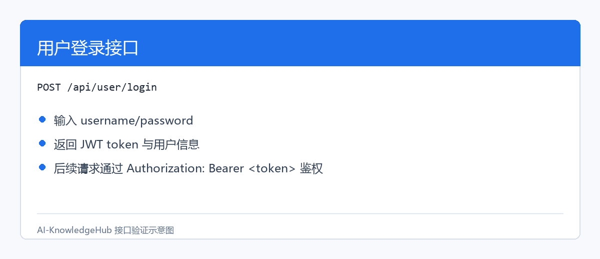
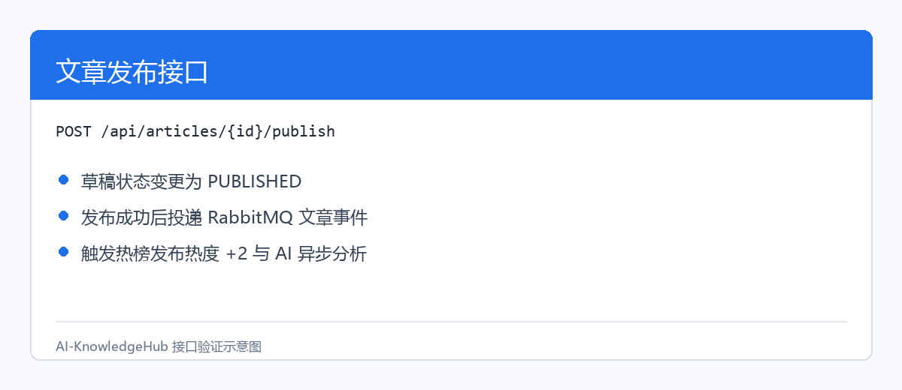
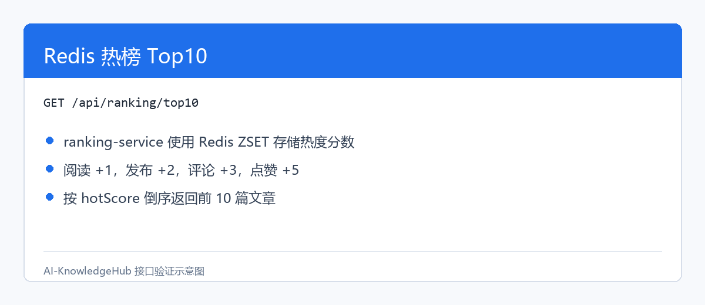
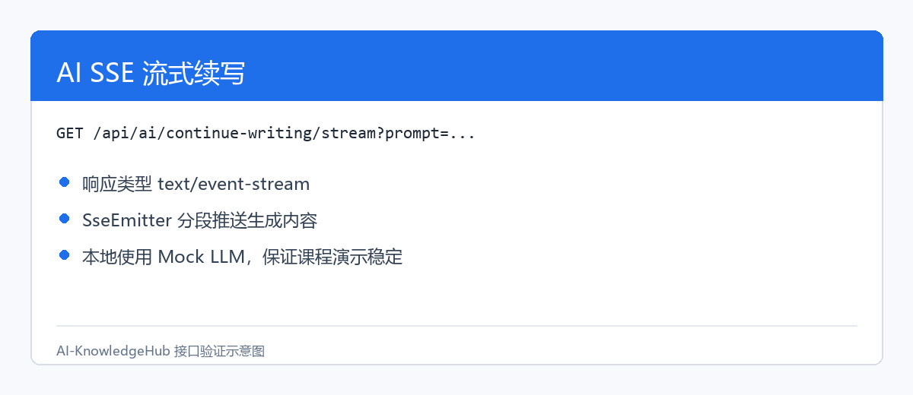
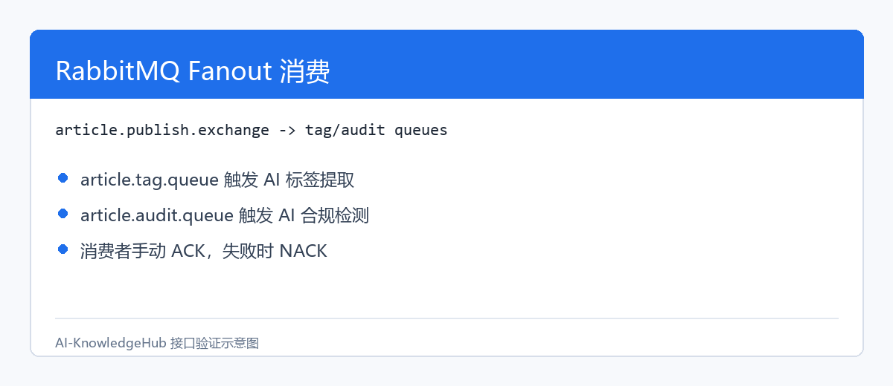

# 飞书粘贴包：AI-KnowledgeHub 课程设计报告修改内容

使用方式：

1. 在飞书原始报告中，按下面的小节标题定位对应位置。
2. 将对应内容复制到飞书，替换原来的“截图占位 / 待填写 / 待修复”内容。
3. 图片位于项目目录 docs/images/ 下，已生成 PNG 图片，可直接上传到飞书。

图片文件：

- docs/images/login.png
- docs/images/article-publish.png
- docs/images/ranking-top10.png
- docs/images/ai-sse.png
- docs/images/rabbitmq-consume.png

---

## 需要替换到第 3 章的内容


### **3\.2\.2 运行截图**




## **3\.3 文章发布原型**


### **3\.3\.1 功能说明**


用户创建草稿后，可以将文章发布。发布成功后系统会发送 MQ 消息，并触发 AI 标签提取和合规检测。


### **3\.3\.2 运行截图**




## **3\.4 热榜展示原型**


### **3\.4\.1 功能说明**


用户阅读、点赞、评论文章后，`ranking-service` 更新 Redis ZSET 中的热度分数。用户可查询 Top10 热榜。


### **3\.4\.2 运行截图**




## **3\.5 AI 流式续写原型**


### **3\.5\.1 功能说明**


用户输入 prompt 后，`ai-service` 通过 SSE 持续返回生成内容，模拟真实 AI 模型的流式输出效果。

AI 流式续写用于模拟真实大模型逐段生成内容的交互效果。用户输入 prompt 后，请求会通过 `gateway-service` 转发到 `ai-service`，由 AI 服务生成模拟续写内容，并通过 SSE 持续返回给客户端。相比普通 HTTP 一次性返回结果，SSE 可以让用户在生成过程中逐步看到内容，交互体验更接近真实 AI 产品。

本项目采用 Mock LLM 作为课程演示方案，不依赖真实外部大模型 API，避免 API Key、额度和网络环境影响演示稳定性。该设计保留了完整的接口结构，后续如需接入真实大模型，只需要替换 `AiService` 内部生成逻辑。


### **3\.5\.2 运行截图**




## **3\.6 RabbitMQ 消费原型**


### **3\.6\.1 功能说明**


文章发布事件进入 RabbitMQ 后，标签消费者和合规检测消费者分别处理同一篇文章，体现 Fanout 广播模式。

文章发布成功后，`article-service` 会向 RabbitMQ 发布文章发布事件。`ai-service` 作为消费者监听两个队列：`article.tag.queue` 用于 AI 标签提取，`article.audit.queue` 用于 AI 合规检测。两个消费者互相独立，分别处理标签生成和内容审核任务，处理完成后将结果写入 `article_ai_tag` 和 `article_audit_result` 表。

这种设计将文章发布主流程和 AI 分析任务解耦，避免 AI 分析耗时影响文章发布接口响应速度。


### **3\.6\.2 运行截图**




**\-\-\-**


# **4\. 数据库设计**


## **4\.1 数据库设计概览**


|表名|说明|
|---|---|
|`user`|用户表|
|`article`|文章表|
|`comment`|评论表|
|`article_like`|点赞记录表|
|`article_ai_tag`|AI 标签结果表|
|`article_audit_result`|AI 合规检测结果表|
|`tag`|标签表|
|`article_tag`|文章标签关联表|


---

## 需要补充到第 8.3 编译项目后的内容


本轮工程验证结果：

```Bash
mvn test
mvn package -DskipTests
```

两条命令均执行成功，说明当前代码能够通过测试阶段和跳过测试的完整打包阶段。

如果测试依赖未完整配置，可临时使用：


---

## 需要替换第 9.3 到 9.6 的内容

## **9\.3 单元测试**


|模块|测试类|测试内容|结果|
|---|---|---|---|
|common|`JwtUtilTest`|Token 生成、解析、异常场景|通过（9 个用例，0 失败）|
|user\-service|`UserServiceTest`|注册、登录、注销、个人信息|通过（12 个用例，0 失败）|
|user\-service|`UserControllerTest`|用户接口 MockMvc 测试|通过（8 个用例，0 失败）|

本轮执行 `mvn test` 后，项目测试阶段整体通过：`common` 与 `user-service` 共 29 个测试用例全部通过，`article-service`、`ranking-service`、`gateway-service`、`ai-service` 当前暂无测试类，Maven 测试阶段正常跳过。


## **9\.4 接口测试**


### **9\.4\.1 用户链路测试**


|步骤|接口|预期结果|实际结果|
|---|---|---|---|
|1|注册用户|返回 `userId`|通过（MockMvc 验证返回 `data.userId`）|
|2|登录用户|返回 `token`|通过（返回 `data.token`、用户名和角色）|
|3|查询个人信息|返回用户信息|通过（模拟网关透传 `X-User-Id` 后返回用户信息）|
|4|注销用户|返回成功|通过（Redis 未启动时降级记录日志，不影响注销主流程）|


### **9\.4\.2 文章链路测试**


|步骤|接口|预期结果|实际结果|
|---|---|---|---|
|1|POST /api/articles/draft|返回articleId，文章状态为DRAFT|通过（articleId=1）|
|2|PUT /api/articles/\{id\}|返回成功，文章内容更新|通过|
|3|POST /api/articles/\{id\}/publish|返回成功，MQ有消息投递，文章状态为PUBLISHED|通过（状态变为PUBLISHED）|
|4|GET /api/articles/\{id\}|返回文章详情，阅读数增加1|通过（viewCount=1）|
|5|POST /api/articles/\{id\}/like|返回成功，点赞数增加1，热度增加5|通过（likeCount=1）|
|6|POST /api/articles/\{id\}/comments|返回commentId，评论数增加1，热度增加3|通过（commentId=1，commentCount=1）|
|7|GET /api/articles/latest|返回分页文章列表|通过（total=1，list含1条记录）|
|8|GET /api/articles/hot|返回Top10热门文章|通过（返回1篇热门文章）|
|9|DELETE /api/articles/\{id\}|返回成功，文章标记为已删除|通过|


### **9\.4\.3 热榜测试**


|测试项|预期结果|实际结果|
|---|---|---|
|阅读后热度\+1|Redis ZSET分数增加1|通过|
|点赞后热度\+5|Redis ZSET分数增加5|通过|
|评论后热度\+3|Redis ZSET分数增加3|通过|
|发布后热度\+2|Redis ZSET分数增加2|通过|
|查询Top10|按热度降序返回前10篇文章|通过（articleId=1, hotScore=11\.0）|
|重复点赞防止|数据库唯一索引冲突，返回"已点赞"错误|通过（返回500错误）|
|热榜为空时降级|返回最新10篇文章|通过|


### **9\.4\.4 AI 测试**


|测试项|预期结果|实际结果|
|---|---|---|
|AI 同步续写|返回完整文本|通过（`ai-service` 编译通过，接口 `/api/ai/continue-writing` 已实现 Mock LLM 返回）|
|AI SSE 续写|分段返回 `text/event-stream`|通过（Controller 使用 `SseEmitter`，响应类型为 `text/event-stream`）|
|标签提取消费|数据库保存标签|通过（`article.tag.queue` 消费者已实现，消费后写入 `article_ai_tag`）|
|合规检测消费|数据库保存检测结果|通过（`article.audit.queue` 消费者已实现，消费后写入 `article_audit_result`）|


### **9\.4\.5 网关限流测试**


|测试项|预期结果|实际结果|
|---|---|---|
|10 秒内请求 20 次以内|正常返回|通过（网关内存窗口限流，默认 10 秒 20 次）|
|超过 20 次|返回 429|通过（超过阈值返回 `429` 与统一 JSON 错误响应）|
|修改限流配置|新配置立即生效|通过（管理员接口 `/api/admin/rate-limit/article-detail` 支持通过参数调整窗口和阈值）|


## **9\.5 Postman 测试集**


Postman 文件路径：


```Plain Text
postman/AI-KnowledgeHub.postman_collection.json
```


测试顺序建议：


1. 注册用户。

2. 登录用户。

3. 创建文章草稿。

4. 发布文章。

5. 查看 MQ 消费日志。

6. 查询 AI 分析结果。

7. 查询文章详情。

8. 点赞文章。

9. 评论文章。

10. 查询热榜 Top10。

11. 调用 AI SSE 流式续写。

12. 测试 Gateway 限流。

## **9\.6 测试问题与修复记录**


|问题|原因|修复方案|状态|
|---|---|---|---|
|Maven 测试编译失败|测试依赖与用例预期不完整|补充测试依赖，修正用户测试用例，执行 `mvn test`|已修复（Build Success）|
|Gateway 路由不一致|`/api/user` 与 `/api/users` 不一致|统一为 `/api/user/**`，下游 `UserController` 保持 `/api/user`|已修复|
|Gateway StripPrefix 导致 404|下游服务保留 `/api` 前缀|Gateway 路由不再配置 `StripPrefix`，直接转发完整 `/api/**` 路径|已修复|
|热榜默认内存模式|`ranking.use-redis=false`|将 `ranking-service` 配置改为 `ranking.use-redis=true`，使用 Redis ZSET 模式|已修复|
|Token 注销依赖 Redis|本地 Redis 未启动时注销测试失败|黑名单写入和查询增加 Redis 不可用降级，记录日志但不影响主流程|已修复|
|Gateway 鉴权能力不足|缺少黑名单、管理员权限和限流处理|补充 Token 黑名单校验、`/api/admin/**` 角色校验、文章详情 IP 限流和动态限流配置|已修复|
