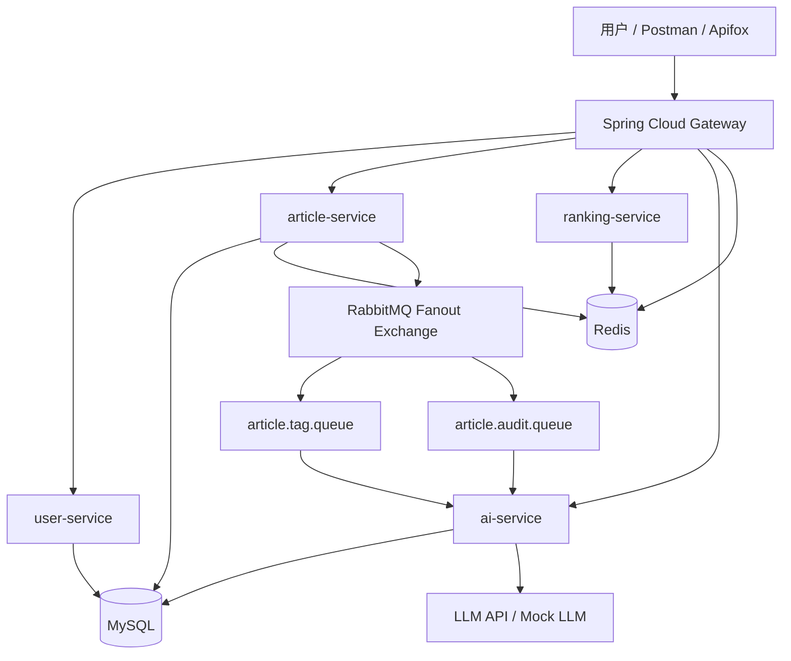

# 系统架构设计

## 总体架构



## 微服务职责

### gateway-service

- 所有请求统一入口。
- JWT Token 校验。
- 普通用户和管理员权限判断。
- IP 限流。
- 从 Redis 或配置读取动态限流参数。
- 路由转发到后端服务。

重点体现：网关层限流、动态限流参数、统一鉴权。

### user-service

- 用户注册。
- 用户登录。
- JWT Token 签发。
- 用户注销。
- 用户资料查询。
- 用户角色管理和管理员权限识别。

核心接口：

- `POST /api/user/register`
- `POST /api/user/login`
- `POST /api/user/logout`
- `GET /api/user/profile`

### article-service

- 创建文章草稿。
- 修改文章。
- 发布文章。
- 逻辑删除文章。
- 分页获取最新文章。
- 获取文章详情。
- 点赞文章。
- 评论文章。
- 阅读文章时更新热度。
- 发布文章后发送 MQ 消息。

核心接口：

- `POST /api/articles/draft`
- `PUT /api/articles/{id}`
- `POST /api/articles/{id}/publish`
- `DELETE /api/articles/{id}`
- `GET /api/articles/latest`
- `GET /api/articles/{id}`
- `POST /api/articles/{id}/like`
- `POST /api/articles/{id}/comments`
- `GET /api/articles/{id}/comments`

### ranking-service

- 使用 Redis ZSET 维护文章热度。
- 阅读文章增加热度。
- 点赞文章增加热度。
- 评论文章增加热度。
- 获取全站 Top10 热榜。
- 可选：定时衰减热度，避免老文章长期霸榜。

核心接口：

- `POST /api/ranking/articles/{id}/view`
- `POST /api/ranking/articles/{id}/like`
- `GET /api/ranking/top10`

### ai-service

- AI 续写普通接口。
- AI 续写 SSE 流式接口。
- 监听 MQ 消息。
- 文章发布后异步提取标签。
- 文章发布后异步进行合规检测。
- 保存 AI 处理结果。

核心接口：

- `GET /api/ai/continue-writing/stream`
- `POST /api/ai/continue-writing`
- `GET /api/ai/articles/{id}/analysis`

## 核心业务链路

### 登录链路

```text
用户登录
-> user-service 校验用户名密码
-> 生成 JWT Token
-> 返回 Token
-> 后续请求携带 Authorization Header
-> gateway-service 校验 Token
-> 转发到对应微服务
```

### 文章详情访问链路

```text
用户请求文章详情
-> gateway-service 执行 IP 限流
-> 限流通过
-> article-service 查询文章详情
-> 更新阅读量
-> Redis ZSET 热度 +1
-> 返回文章详情
```

### 文章点赞链路

```text
用户点赞文章
-> gateway-service 校验 JWT
-> article-service 判断是否重复点赞
-> 写入 article_like
-> article.like_count +1
-> Redis ZSET 热度 +5
-> 返回点赞成功
```

### 文章发布异步处理链路

```text
用户发布文章
-> article-service 修改文章状态为 PUBLISHED
-> 发送 ArticlePublishedEvent 到 RabbitMQ Fanout Exchange
-> 立即返回发布成功
-> AI 标签消费者收到消息
-> 调用 LLM 或 Mock 提取标签
-> 保存标签结果
-> AI 合规消费者收到消息
-> 调用 LLM 或 Mock 做合规检测
-> 保存检测结果
```

### AI 流式续写链路

```text
用户调用 AI 续写接口
-> gateway-service 转发请求
-> ai-service 调用 LLM Streaming API 或 Mock Streaming
-> ai-service 将模型输出转换为 SSE
-> 客户端逐字或逐句接收内容
```

